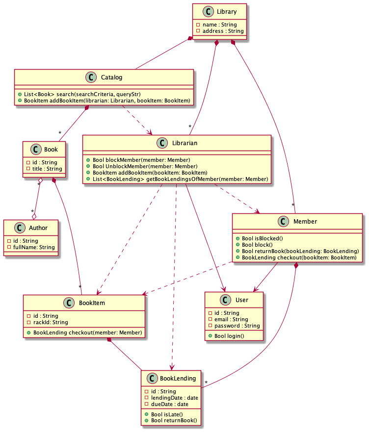

= The complexity of Object Oriented Programming: Classic OO design
:page-layout: post
:page-description: The complexity of Object Oriented Programming
:page-categories: databook
:page-guid: 6071166D-8595-43D1-9ED1-CD7B5F8F8BDF
:page-booktitle: Chapter 1, Part 1
:page-bookorder: 01_01
:page-thumbnail: assets/klipse.png
:page-liquid:
:page-author: Yehonathan Sharvit
:page-date:   2020-09-25 07:45:32 +0200
:page-tags: [dop]

++++

++++

In the link:[introduction], we discussed how Data Oriented Programming differs from Object Oriented (OO) Programming and from Functional Programming (FP).

In this chapter, we explore the tendency of OO systems to be complex.

This complexity is not related to the syntax or the semantics of a specific OO language. It is something that is inherent to OO fundamental insight that programs should be composed from objects that consist of some state together with methods for accessing and manipulating that state.

In this chapter, we illustrate how some core aspects of OO tend to increase the complexity of OO systems.
[#oo-increases-compplexity]
.Aspects of Object Oriented programming and their impact on complexity
|===
| Aspect                       | Impact on complexity

| Code and data are mixed      | Classes tend to be involved in many relations
| Objects are mutable          | Extra thinking when reading code that involves state mutation
| Objects are mutable          | Explicit synchronization on multi-threaded environments
| Data is locked in objects    | Data serialization is a nightmare
| Code is locked in classes    | Class hierarchies are complex
|===

Over the years, OO ecosystems have alleviated this complexity increase by adding new features to the language (e.g. anonymous classes and anonymous functions) and by developing frameworks that hide part of this complexity by providing a simpler interface to the developers (e.g. Spring and Jackson in Java). Internally, they rely on advanced features of the language (like reflection and custom annotations).

This chapter is not meant to be read as a critics of OO programming. Its purpose is to increase your awareness about the complexity of OO as a programming paradigm.
I hope that after reading this chapter, you will be motivated to discover a different programming paradigm where this complexity tend to be less present, namely Data Oriented programming.

== OO design: classic or classical?

It's Monday morning 9:00 AM, you seat at a coffee shop with a potential customer, Nancy, that needs you to build a new library management system.

"What's a library management system in your mind?" you ask.

"It's a system that handles housekeeping functions of a library, mainly around the book collection
and the library members" Nancy replies

"Could you be a little bit more precise?" you ask politely.

"Sure" Nancy answers.

She grabs the napkin under her coffee mug and she writes down a couple of bullet points on the napkin:

. Two kinds of users: library members and librarians
. Users log in to the system via email and password.
. Members can borrow books
. Members and librarians can search books by title or by author
. Librarians can block and unblock members (e.g. when they are late in returning a book)
. Librarians can list the books currently lent by a member
. There could be several copies of a book

"Well, that's pretty clear."

"When will you be able to deliver it?"

"If you give me a down payment today, I should be able to deliver it by next Wednesday."

"Fantastic! I'll make you a bitcoin transfer later today."

You get back to your office with Nancy's napkin in your pocket.

Before rushing to your laptop to code the system,
you grab a sheet of paper - slightly bigger than the napkin - and you prepare yourself to draw the UML class diagram of the system.

Everything in life is an object and every object is made from a class. Right?

Here are the main classes that you identify for the library management system:

* `Library`: The central part for which the system is designed
* `Book`: A book
* `BookItem`: A book can have multiple copies, each copy is considered as a book item
* `BookLending`: When a book is lent, a book lending object is created
* `Member`: A member of the library
* `Librarian`: A librarian
* `User`: A base class for `Librarian` and `Member`
* `Catalog`: Contains list of books
* `Author`: A book author

That was the easy part. Now comes the difficult part: the relationships between the classes.

After two hours or so, you come up with a first draft of a design for the
library management system. It looks like the diagram shown on <<lib-mgmt-class-diagram>>.

[#lib-mgmt-class-diagram]
.A class diagram for a Library management system

This design is meant to be very simple and by no means it pretends to cover all the features of the system.
This design serves two purposes:

. For you - the developer - it is rich enough to start coding
. For me - the author of the book - it is rich enough to illustrate the complexity of a typical OO system

You feel proud of yourself and of the design you produced. You definitely deserve a cup of coffee.
Near the coffee machine, you meet Dave, a junior software developer that you appreciate.

- Hey Dave! How are you doing?

- Trying to fix a bug in my code: I cannot understand why the state of my objects always change! You?

- I have just finished the design of a system for a new customer.

- Cool! Can you show me your design?

- Sure.

Are you curious to discover Dave's reaction to your design?

Read the link:[next part].

++++

++++
