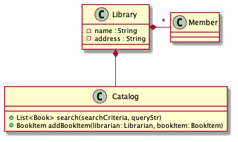
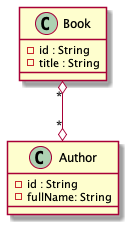
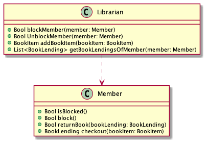
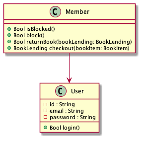
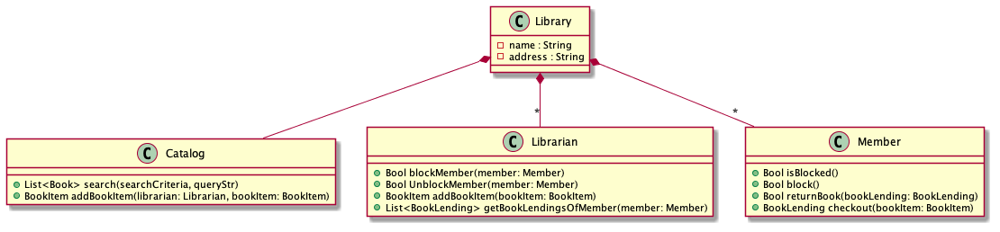
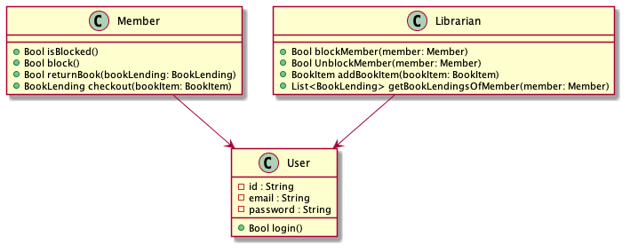
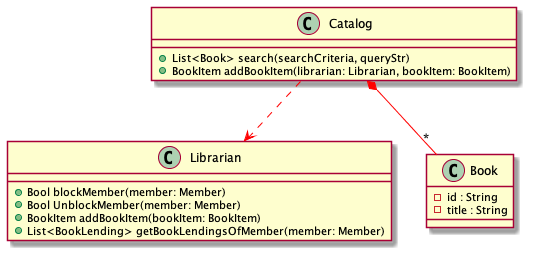
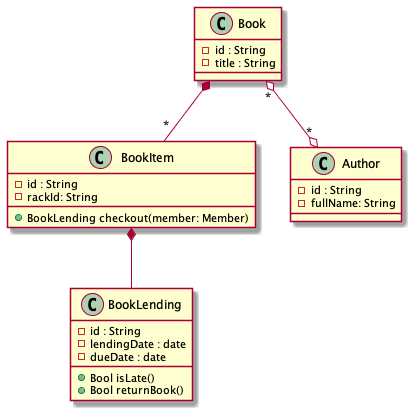

= The complexity of Object Oriented Programming: A bit of UML
:page-layout: post
:page-description: The complexity of Object Oriented Programming
:page-categories: databook
:page-guid: E7BABC47-3BA8-4012-B781-AA94AD979435
:page-booktitle: Chapter 1, Part 2
:page-bookorder: 01_02
:page-thumbnail: assets/klipse.png
:page-liquid:
:page-author: Yehonathan Sharvit
:page-date:   2020-09-25 06:45:32 +0200

++++

++++

In the link:[previous part], we presented a possible OO design for a library management system.

In this part, we continue our exploration of the tendency of OO systems to be complex.

== Dave\'s reaction to your design

Dave follows you to your desk and you show him your piece of art: the UML diagram.

"Wow! Such a detailed class diagram." Dave is really excited.

"Yeah. It's pretty neat." You reply proudly.

"The thing is that I can never remember the meaning of each arrow" Dave admits.

"There are 4 types of arrows in my class diagram: composition, association, inheritance and usage", you reply with a feeling of superiority.

"What's the difference between composition and association?", Dave asks.

You google "composition vs association" and you read loudly to Dave:

"It's all about whether the objects can live one without each other:
with *composition*, when one object dies, the other one dies also,
while in an *association* relation, each object has an independent life."

In my class diagram, there are two kinds of *composition* relation,
symbolized by an arrow with a plain diamond at one edge, and an optional star at
the other edge:

. A `Library` owns a `Catalog`. That's a one-to-one composition relation: if a `Library` object
dies, then its `Catalog` object dies with it.
.  A `Library` owns many ``Member``s. That's a one-to-many composition relation: if a `Library` object
dies, then all its `Member` objects die with it.

[#composition-diagram]
.Two kinds of composition: one to one and one to many. In both cases, when an object dies, the composed object dies with it.

"Do you have association relations in your diagram?" Dave asks

"Yeap. Take a look at the arrow between `Book` and `Author`.
It has an empty diamond and a start at both edges: it's a many to many association relation".

Indeed, a book can be written by multiple authors
and an author can write multiplet books.
Moreover, `Book` and `Author` objects can live independently.

[#association-diagram]
.Many to many association relation: each object lives independently

"I see also many dashed arrows in your diagram", Dave notices.

"Dashed arrows are for *usage* relations: when a class uses a method of another class.
Consider for example, at the `Librarian::blockMember()` method. It calls `Member::block()`."

[#usage-diagram]
.Usage relation: a class uses a method of another class

"I see. And I guess that plain arrows - like the one between `Member` and `User` - represent inheritance."

"Absolutely"

[#inheritance-diagram]
.Inheritance relation: a class derives from another class

"Great! Now that I understand the meaning of each kind of arrow.
"Where should I look first?" Dave asks

"I think you should start from `Library`."
[#library-diagram]
.The `Library` class

In terms of code, a `Library` object does nothing on its own, it delegates everything to objects it owns:

. It owns multiple `Member` objects
. It owns multiple `Librarian` objects
. It owns a single `Catalog` object

"Looks pretty clear to me. What's next?"

"`Librarian` and `Member` who both derive from `User` "

[#user-diagram]
.`Librarian` and `Member` derive from `User`

The `User` class represents a user of the library.

. In terms of data members, I stick to the bare minimum: it has a `id`, `email` and `password`
(I'll deal with security and encryption, later).
. In terms of code, it can login via `login()`

The `Member` class represents a member of the library.

. It derives from `User`
. In terms of data members, it has nothing more than `User`
. In terms of code, it can:
.. Checkout a book via `checkout()`
.. Return a book via `returnBook()`
.. Answer if it is blocked via `isBlocked()`
. It owns multiple `BookLending` objects
. It uses `BookItem` in order to implement `checkout()`

The `Librarian` class represents a librarian.

. It derives from `User`
. In terms of data members, it has nothing more than `User`
. In terms of code, it can:
.. Block and unblock a `Member`
.. List the book lendings of a member via `getBookLendings()`
.. Add book items to the library via `addBookItem()`
. It uses `Member` in order to implement `blockMember()`, `UnblockMember()` and `getBookLendings()`
. It uses `BookItem` in order to implement `checkout()`
. It uses `BookLending` in order to implement `getBookLendings()`

"What class should I look at now?"

"The `Catalog` class who is responsible for the management of the books."

[#catalog-diagram]
.The `Catalog` class

.In terms of code, a `Catalog` object can:
.. Search books via `search()`
.. Add book items to the library via `addBookItem()`
. It owns multiple `Book` objects
. It uses `Librarian` in order to implement `addBookItem`

"Then we have the `Book` class"

[#book-diagram]
.The `Book` class

. In terms data members, we stick to the bare minimum: it has a `id`, and a `title`
. It is associated with multiple `Author` objects (A book might have multiple authors)
. It owns multiple `BookItem` objects, one for each copy of the book

"What's a `BookItem`?"

"The `BookItem` class represents a book copy. A book could have many copies."

. In terms data members, we stick to the bare minimum: it has a `id`, and a `rackId` (for its physical location in the library)
. In terms of code, it can be checked out via `checkout()`
. It owns multiple `BookLending` objects, one for each time the book is lent

"Wow! That's amazing" Dave compliments you. "I didn't know people were
really spending time to write down their design in such details, before coding."

"I always do that. It saves me lots of coding errors", you reply proudly.

"When will you start coding?" Dave asks

"When I finish my coffee".

You look at your coffee mug and it's full (and cold).
You were so excited to show your class diagram to Dave that you forgot to drink your coffee.

Go and make yourself another cup of coffee before you move to the link:[next part].

++++

++++
