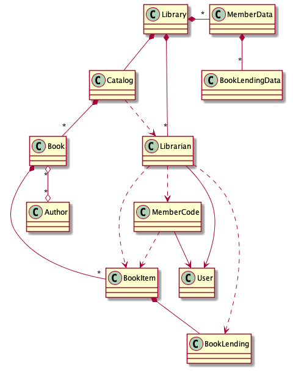

= The complexity of Object Oriented Programming: What\'s wrong with you OO?
:page-layout: post
:page-description: The complexity of Object Oriented Programming
:page-categories: databook
:page-guid: 64D2ED92-6627-4A04-BAC0-98F9BB281FB9
:page-booktitle: Chapter 1, Part 3
:page-bookorder: 01_03
:page-thumbnail: assets/klipse.png
:page-liquid:
:page-author: Yehonathan Sharvit
:page-date:   2020-09-25 06:45:32 +0200
:page-tags: [dop]

++++

++++

In the link:[previous part], you presented your design to Dave.

In this part, we continue our exploration of the tendency of OO systems to be complex.

== What\'s wrong with you OO?

Before you start coding, and while you prepare yourself another cup of coffee, I would like to
challenge your design. It might look beautiful and clear on the paper but, this design is too complex.
It's not that you picked the wrong classes
or that you misunderstood the relationships between the classes. It's much deeper.
It's about the programming paradigm you chose to implement the system.
It's about the Object Oriented paradigm. It's about OO.

[quote]
OO is too complex.

The purpose of this book is to present a much simpler programming paradigm called Data Oriented Programming (DO).
If you are already convinced that OO is too complex,
you can skip to the next chapter and start your journey into DO.

If you are a skeptic about that, please keep reading.

According to DO, the main sources of complexity of your system - and of any OO system - are:

. Code and data are mixed
. Objects are mutable
. Data is locked in objects as members
. Code is locked into classes as methods

In this section, we are going to illustrate each of the above points in the context
of the library management system
and explain in what sense it is a source of complexity.

=== Code and data are mixed

One way to assess the complexity of a class diagram is to look only at the entities and their relationships
(ignoring members and methods) as in <<lib-mgmt-class-diagram-overview>>.

Don't you think this diagram is too complex for such a simple system?

[#lib-mgmt-class-diagram-overview]
.A class diagram overview for a Library management system
image::../uml/complex-class-relation.png[]

When we design a system, no matter whether it's OO or DO,
we have to define the relationships between different pieces of code and data: that's unavoidable.

In OO, code and data are mixed together in classes, data as members and code as methods.
From a system analysis perspective, the fact that code and data are mixed together makes the system complex
in the sense that entities tend to be involved in many relationships.

Take a look for instance at the `Member` class in our class diagram <<lib-mgmt-class-diagram-overview>>.
It is involved 5 relations: 2 data relations and 3 code relations.

.. Data relations:
... `Library` has ``Member``s
... `Member` has ``BookLending``s

.. Code relations:
... `Member` extends `User`
... `Librarian` uses `Member`
... `Member` uses `BookItem`

Imagine for a moment that we were able somehow to split the `Member` class into two separate entitites:

.`MemberCode` for the code
.`MemberData` for the data

Instead of a `Member` class with 5 relations, we would have as shown in <<lib-mgmt-member-split>>:

. A `MemberCode` entity with 3 relations
. A `MemberData` entity with 2 relations

[#lib-mgmt-member-split]
.A class diagram where `Member` is split into code and data entities

Not yet convinced that this imaginary system is simpler than the original one?

No problem, I know how to convince you.

Let's split every class of our original class diagram into code and data entities.
Now we have a system  made of two disjoint parts as shown in <<lib-mgmt-simplified-class-diagram>>:

. A part that involves only code entities
. A part that involves only data entities

[#lib-mgmt-simplified-class-diagram]
.A class diagram where every class is split into code and data entities
image::../uml/data-code-relation.png[]

I hope that you agree that this system, made of two disjoint sub-systems, is simpler than the original one.
It's not simpler by accident, it is a logical consequence of separating code and data.

IMPORTANT: A system made of disjoint simple parts is less complex than a system made of a single complex part.

=== Objects are mutable

You are probably a bit tired with all the system-level analysis that we presented in the previous section.

Let's get refreshed and look at some code. Well not exactly code, but pseudocode.

Please take a look at the pseudocode shown in <<code-simple>>:
we get the blocked status of a member and we display it twice.

If I tell you that when I called `displayBlockedStatusTwice`,
the program displayed `true` on the first `print` call,
can you tell me what the program displayed on the second `print` call?

[source,java]
----
class Member {
      Bool member;

      void displayBlockedStatusTwice() {
         isBlocked = this.isBlocked()
         System.Print(isBlocked);
         System.Print(isBlocked);
    }
}
----

"Of course, it displayed `true` again", you tell me.

And you are right.

Now, please take a look at a slightly different pseudocode as shown in <<code-block-member>>:
here we display twice the blocked status of a member without assigning a variable.

Same question as before:
If I tell you that when I called `displayBlockedStatusTwice`,
the program displayed `true` on the first `print` call,
can you tell me what the program displayed on the second `print` call?

[[code-block-member]]
.Apparently simple pseudo code
[source,java]
----
class Member {
      Bool member;

      void displayBlockedStatusTwice() {
        System.Print(this.isBlocked);
        System.Print(this.isBlocked);
    }
}
----

If your answer is `false`, I am suggesting you to consult a therapist.

If your answer is `true`, I am suggesting you to take a few seconds and think about it again.

I'll give you a clue: multi threading.

The correct answer is: in a single threaded environment, it displays `true`
while on a multi threaded environment it's unpredictable.

Indeed in a multi threaded environment, between the two print calls,
there could be a context switch and the state of the member object could be changed (e.g. a librarian unblocked the member).

The difference between the two pseudocode snippets is that:

* in the first snippet, we access twice a boolean value which is a primitive value
* in the second snippet, we access twice a member of an object

This unpredictable behavior of the second snippet is one of the annoying consequences of the fact that in OO, unlike
primitive types who are immutable, object members are mutable.

One way to solve this problem in OO is to protect sensitive code with mutexes, but it introduces issues on its own like a performance hit and a risk of deadlocks.

We will see later in the book that DO treats every piece of data in the same way: both primitive types and collection types have immutable values.
This "value treatment for all citizens" brings to DO developers' minds a lot of serenity.
As a consequence, more cells of DO developers' minds are available
to handle the interesting pieces of the applications they build.

Until then, keep you mind busy with boring stuff.

When you feel ready to explore more sources of complexity in OO, move to the link:[next part].

++++

++++
