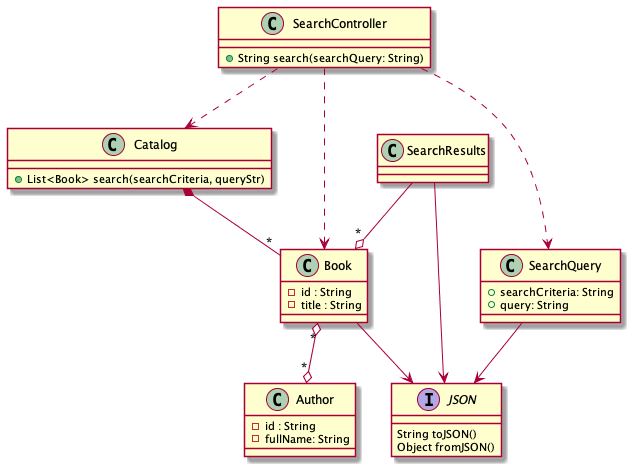
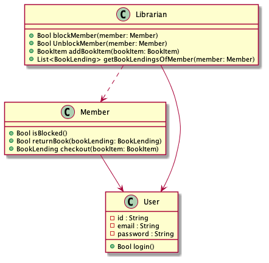
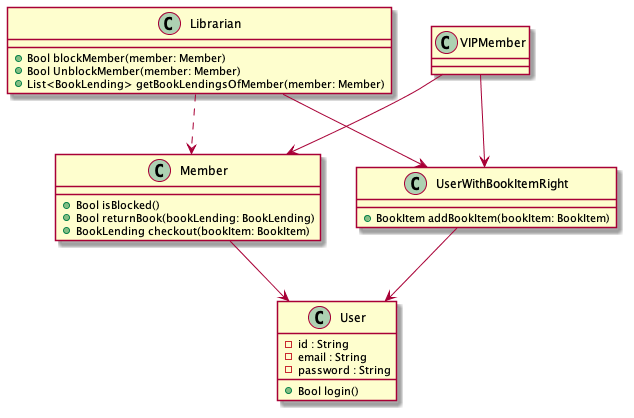
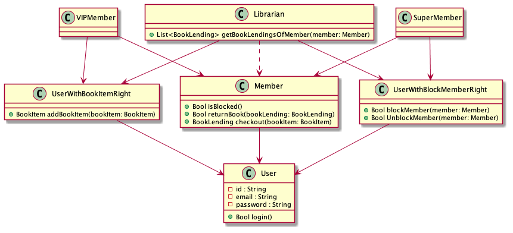

= The complexity of Object Oriented Programming: DO magic sauce
:page-layout: post
:page-description: The complexity of Object Oriented Programming
:page-categories: databook
:page-guid: 475A3C20-D7A4-4710-BB7B-544FA6BE1B83
:page-booktitle: Chapter 1, Part 4
:page-bookorder: 01_04
:page-thumbnail: assets/klipse.png
:page-liquid:
:page-author: Yehonathan Sharvit
:page-date:   2020-09-25 06:45:32 +0200
:page-tags: [dop]

++++

++++
According to DO, the main sources of complexity of any OO system - are:

. Code and data are mixed
. Objects are mutable
. Data is locked in objects as members
. Code is locked into classes as methods

In the link:[previous part], we explored item #1 and #2.

In this part, we are going to explore item #3 and #4.

== What\'s wrong with you OO?

=== Data is locked in objects as members

Now, you are really tired and you fall asleep at your desk...

You have a dream about Nancy, your customer.

In this dream, Nancy would want to make the library management system accessible via a REST API
using JSON as a transport layer.

You would need to implement a `/search` endpoint that receives
a query in JSON format and return results in JSON format.

An input example of the `/search` endpoint is shown in <<Listing-search-input-json>>.

[[Listing-search-input-json]]
.A JSON input of the `/search` endpoint
[source,json]
----
{
  "searchCriteria": "author",
  "query": "albert"
}
----

An output example of the `/search` endpoint is shown in <<Listing-search-output-json>>.

[[Listing-search-output-json]]
.A JSON output of the `/search` endpoint
[source,json]
----
[
    {
        "title": "The world as I see it",
        "authors": [
            {
                "fullName": "Albert Einstein"
            }
        ]
    },
    {
        "title": "The Stranger",
        "authors": [
            {
                "fullName": "Albert Camus"
            }
        ]
    }
]
----

You would probably implement the `/search` endpoint by creating three classes similarly to what is
shown in <<json-search-controller>> (Not surprising: everything in OO has to be wrapped in a class. Right?):

. `SearchController` that is responsible for handling the query
. `SearchQuery` that converts the JSON query string into data
. `SearchResult` that converts the search result data into a JSON string

The `SearchController` would have a single `handle` method with the following flow:

. Create a `SearchQuery` object from the JSON query string
. Retrieve `searchCriteria` and `queryStr` from the `SearchQuery` object
. Call the `search` method of the `catalog:Catalog` with  `searchCriteria` and `queryStr` and receives `books:List<Book>`
. Create a `SearchResult` object with `books`
. Convert the `SearchResult` object to a `JSON` string

[#json-search-controller]
.A class diagram where every class is split into code and data entities

What about other endpoints, for instance allowing librarians to add book items through `/add-book-item`?

Well, you would have to repeat the exact same process and create 3 classes:

. `AddBookItemController` that is responsible for handling the query
. `BookItemQuery` that converts the JSON query string into data
. `BookItemResult` that converts the search result into a JSON string

The code that deals with JSON deserialization that you wrote previously in `SearchQuery` would have to
be rewritten in `BookItemQuery`.
Same thing for the code that deals with JSON serialization that you wrote previously in `SearchResult`:
it would have to be rewritten in `BookItemResult`.

The bad news is that you would have to repeat the same process for every endpoint of the system.
Each time you encounter a new kind of JSON input or input, you have to create a new class and write code.

Suddenly, you wake up and realize that Nancy never asked for JSON.
All of the above was a dream, a really bad dream...

[quote]
In OO, data serialization is a nightmare

It's quite frustrating that handling JSON serialization and deserialization in OO requires
to add so many classes and to write so much code again and again!

The frustration gets bigger when you consider that serializing a search query, a book item query or any query is quite similar.
It comes down to:

. Go over data fields
. Concatenate the name of the data fields and the value of the data field (separated by a comma)

Why such a simple thing is so hard to achieve in OO?

The thing is that in OO, data has to follow a rigid shape (defined in classes),
which means that data is locked in members.
There is no way to access data generically.

[quote]
In OO, data is locked in classes as members

We will refine later what we mean by a generic access to the data and
we will see how DO provides a generic way to handle JSON serialization and deserialization.
Until then, you will have to continue suffering.
But at least you know that this suffer is avoidable. (Not sure if it makes your suffer more pleasant or more painful...)

NOTE: Most OO programming languages provide ways to ease a bit the conversion from and to JSON. It either involves reflection (which is definitely a complex thing) or code verbosity.

=== Code is locked into classes as methods

It is a common belief that OO promotes code reuse through class inheritance.
Indeed, when every requirement of the system is known up front, you design your class hierarchy is such a way that
classes with common behavior derive from a base class.
An example of this pattern is shown in <<class-diagram-librarian-member>> , that zooms in the part of our
class diagram that deals with members and librarians.
Both librarians and members need the ability to login and they inherit this ability form the `User` class.
So far so good.

[#class-diagram-librarian-member]
.The part of the class diagram that deals with members and librarians

But when requirements to the system are added after the system is implemented that's a completely different story.

It's Monday 11:00 AM, two days are left before the deadline (which is on Wednesday midnight) and Nancy put your on an urgent phone call.

You are not sure if it's dream or reality.
You pinch yourself and you feel the jolt.
It's definitely reality!

++++
- How is the project doing?
- Fine, Nancy. We are on schedule for the deadline. Running our last round of regression tests.
- Fantastic! It means we have time for adding a tiny feature to the system. Right?
- Depends what you mean by "tiny".
- We need to add VIP members to the system.
- What do you mean by VIP members?
- VIP members are members that are allowed to add by themselves book items to the library.
- Hmm...
- What?
- That's not a tiny change!
- Why?
++++

I am asking you the same question Nancy asked: Why adding VIP members to your system is not a tiny task?

After all, you already have written the code that allows librarians to add book items to the library:
it's in `Librarian::addBookItem()`.
What prevents you from reusing this code for VIP members?

The reason is that in OO, the code is locked into classes as methods.

Let's see how you would probably handle this last minute request from your customer.

[quote]
VIP members are members that are allowed to add by themselves book items to the library.

Let's decompose the customer requirements into two pieces:

. VIP members are members
. VIP members are allowed to add by themselves book items to the library

For sure, you need a new class `VIPMember`.

For requirement #1, it sounds reasonable to make `VIPMember` derive from `Member`.

However, handling requirement #2 is more complex. We cannot make `VIPMember` derive from `Librarian` because the relationship between `VIPMember` and `Librarian` is not linear:

. On one hand, VIP members are like librarians as they are allowed to add book items
. On the other hand, VIP members are not like librarians as they are not allowed to block members or to list the book lendings of a member

The problem is that the code that adds book items is locked in the `Librarian` class.
There is no way for `VIPMember` class to use this code.

One possible solution that makes the code of `Librarian::addBookItem()` available to both `Librarian` and `VIPMember`,
is shown in <<class-diagram-vip-member>>. Here are the changes to the previous class diagram:

. A base class `UserWithBookItemRight` that extends `User`
. Move `addBookItem()` from `Librarian` to `UserWithBookItemRight`
. Both `VIPMember` and `Librarian` extend `UserWithBookItemRight`

[#class-diagram-vip-member]
.A class diagram for a system with VIP members

That was tough but you were able to handle it on time (thanks to a white night in front of your laptop).
You were even able to include new tests to the system and running again the regression tests.
You were so excited that you didn't pay attention to the diamond `VIPMember` introduced in your class diagram,
(`VIPMember` extends both `Member` and `UserWithBookItemRight` who both extend `User`)

We are Wednesday morning 10:00 AM, 14 hours before the deadline and you call Nancy to tell her the good news:

- We were able to add VIP members to the system on time, Nancy.
- Fantastic! I told you it was a tiny feature.
- Hmm...
- Look, I was to call you anyway. I just finished a meeting with my business partner and we realized that we need another tiny feature before the launch. Will you be able to handle it before the deadline?
- Again, it depends what you mean by "tiny".
- We need to add Super members to the system.
- What do you mean by Super members?
- Super members are members that are allowed to block and unblock members
- Hmm...
- What?
- That's not a tiny change!
- Why?

Like with VIP members, adding Super members to the system requires changes to your class hierarchy.
A possible solution is shown in <<class-diagram-super-member>>.

[#class-diagram-super-member]
.A class diagram for a system with Super members and VIP members

The addition of Super members made the system too complex. You suddenly noticed that you had 3 diamonds in your class diagram:
not gemstones but 3 Deadly Diamonds of Death!

You tried to avoid the diamonds by transforming the `User` class into an interface and using Composition over Inheritance Design Pattern.
But with the stress of the deadline coming, you were not able to use all the cells of your brain. (Indeed all the cells of a human brain are required to handle this OO complexity!)

In fact, this complexity prevented you from delivering the system before the deadline.

You call the customer in order to explain her the situation at 10:00 PM, two hours before the deadline:

- Look Nancy, we really did our best, but we will not be able to add Super members to the system before the deadline
- No worries, my business partner and I decided to postpone the launch by a week
- Phew!
- Do you think that if we add other tiny features next week, you'd be able to handle them on time?
- Yes
- How could it be?
- We are going to refactor the system from Object Oriented to Data Oriented over the weekend.
- What is Data Oriented?
- It is a magic sauce that allows developers to write code faster!

By the end of this book, you will belong to the community of happy developers who know the recipe
of DO magic sauce.

You must be tired with all this OO complexity.

I invite you to imagine a world with no objects and sing a song. Here are the link:[lyrics].

++++

++++
