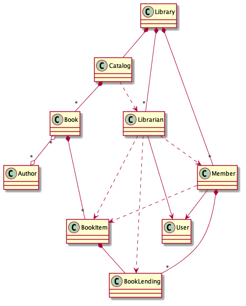
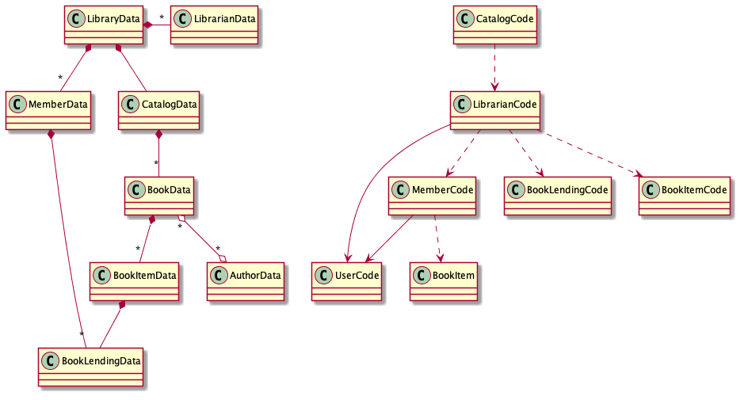

= DO Principle #1: Separate code from data
:page-layout: post
:page-description:  Principles of Data Oriented Programming. Principle #1: Separate code from data. Benefits and price. Pros and Cons. Simpler systems. Systems less complex. Object oriented programming. Functional programming.
:page-guid: F3112EEC-3EC1-4757-BD6D-970AEA98D87B
:page-thumbnail: assets/klipse.png
:page-categories: databook
:page-booktitle: Chapter 2, Part 1
:page-bookorder: 02_01
:page-liquid:
:page-author: Yehonathan Sharvit
:page-date:   2020-10-02 09:31:24 +0200
:page-tags: [dop]

++++

++++

== The principle in a nutshell

[quote]
Principle #1: Separate code from data in a way that code resides in functions whose behavior does not depend on data that is somehow encapsulated in the function's context.

== Remarks on Principle #1

* In pure FP, functions behavior depend only on its arguments, but it is not a requirement for DO (global variables are allowed in DO).
* It is possible to break this principle in FP, by hiding state in the lexical scope of a function.
* It is possible to be compliant with this principle in OOP: The functions could be aggregated as methods of a static class for instance.
* This principle doesn't relate to the way data is modeled. We could be compliant with this principle by creating a specific class for each kind of data.

== Illustration of Principle #1

Let me illustrate how we can follow this principle or break it on a simplistic program that deals with:

. An author entity with a `firstName`, a `lastName` and a number of `books` he/she wrote
. A piece of code that calculates the full name of the author and a number of `books` he/she wrote
. A piece of code that determines if an author is prolific, based on the number of books he/she wrote

We break this principle when we combine data and code together in an object, like this:

[source, klipse-javascript]
----
class Author {
  constructor(firstName, lastName, books) {
    this.firstName = firstName;
    this.lastName = lastName;
    this.books = books;
  }
  fullName() {
      return this.firstName + " " + this.lastName;
  }
  isProlific() {
    return this.books > 100;
  }
}

var obj = new Author("Isaac", "Asimov", 500); // Isaac Asimov wrote 500 books!
obj.fullName();
----

We break this principle **even without classes**, when we hide the data in the lexical scope of a function:

[source, klipse-javascript]
----
function createAuthorObject(firstName, lastName, books) {
 return {
   fullName: function() {
       return firstName + " " + lastName;
      },
    isProlific: function () {
      return books > 100;
    }
  };
 }

var obj = createAuthorObject("Isaac", "Asimov", 500); // Isaac Asimov wrote 500 books!
obj.fullName();
----

We are compliant with this principle when we separate the code and the data, like this:

[source,klipse-javascript]
----
function createAuthorData(firstName, lastName, books) {
   return {firstName: firstName, lastName: lastName, books: books};
}

function fullName(data) {
   return data.firstName + " " + data.lastName;
}

function isProlific (data) {
  return data.books > 100;
}

var data = createAuthorData("Isaac", "Asimov", 500); // Isaac Asimov wrote 500 books!
fullName(data);
----

We are compliant with this principle **even with classes** when we write our code in static classes and store our data in classes with no functions, like this:

[source, klipse-javascript]
----
class AuthorData {
  constructor(firstName, lastName, books) {
    this.firstName = firstName;
    this.lastName = lastName;
    this.books = books;
  }
}

class NameCalculation {
  static fullName(data) {
    return data.firstName + " " + data.lastName;
  }
}

class AuthorRating {
  static isProlific (data) {
    return data.books > 100;
  }
}

var data = new AuthorData("Isaac", "Asimov", 500); // Isaac Asimov wrote 500 books!
NameCalculation.fullName(data);
----

Now that we have illustrated how one could follow or break Principle #1, both in OOP and FP,
let's explore what benefits Principle #1 brings to our programs.

== Benefits of Principle #1

When we are careful to separate code and data, our programs benefit from:

. Code can be reused in different contexts
. Code can be tested in isolation
. Systems tend to be less complex

=== Benefit #1: Code can be reused in different contexts

Imagine that we have in our program an entity that is similar to an author e.g. an artist that has the same `firstName` and `lastName` fields as an author.

In the version with `createAuthorObject`, we cannot reuse the code of `fullName` on an artist in a straightforward way.

One way to deal with that is to use OO mechanisms like inheritance or composition to let the `artist` and the `author` object use the same `fullName` method.
In a simplistic use case like the author and the artist that's fine but on real world systems, the usage of OO mechanisms tends to increase complexity.

Another option is to rewrite the code of `fullName` inside a `createArtistObject` function:

[source, klipse-javascript]
----
function createAuthorObject(firstName, lastName, books) {
   var data = {firstName: firstName, lastName: lastName, books: books};

 return {
   fullName: function fullName() {
       return data.firstName + " " + data.lastName;
      }
  };
 }

function createArtistObject(firstName, lastName, genre) {
   var data = {firstName: firstName, lastName: lastName, genre: genre};

 return {
   fullName: function fullName() {
       return data.firstName + " " + data.lastName;
      }
  };
 }

var obj = createArtistObject("Maurits", "Escher", "Painting");
obj.fullName();
----

In the DO version where `createAuthorData` and `fullName` are separate, we don't need to make any modification to the existing code (the code that deals with author).
We simply leverage the fact that
the data that is relevant to the full name calculation for an artist and an author
follows the same shape and we call `fullName` on an artist data.

[source,klipse-javascript]
----
function createAuthorData(firstName, lastName, books) {
  return {firstName: firstName, lastName: lastName, books: books};
}

function fullName(data) {
  return data.firstName + " " + data.lastName;
}

function createArtistData(firstName, lastName, genre) {
   return {firstName: firstName, lastName: lastName, genre: genre};
}
----

The `fullName` function works properly both on author data and on artist data:

[source, klipse-javascript]
----
var data = createAuthorData("Isaac", "Asimov", 500);
fullName(data);
----

[source, klipse-javascript]
----
var data = createArtistData("Maurits", "Escher", "Painting");
fullName(data);
----

When applied, this principle allows code to be reused in a straightforward way, **even when we use classes**.
In statically typed OO languages (like Java or C#), we would have to create a common interface
for `AuthorData` and `ArtistData`, but in a dynamically typed language like JavaScript, it is not required:

[source,klipse-javascript]
----
class AuthorData {
  constructor(firstName, lastName, books) {
    this.firstName = firstName;
    this.lastName = lastName;
    this.books = books;
  }
}

class NameCalculation {
  static fullName() {
    return data.firstName + " " + data.lastName;
  }
}

class ArtistData {
  constructor(firstName, lastName, books) {
    this.firstName = firstName;
    this.lastName = lastName;
    this.books = books;
  }
}

// required trick to make the classes accessible to other snippets
window.AuthorData = AuthorData
window.NameCalculation = NameCalculation
window.ArtistData = ArtistData
----

The code of `NameCalculation.fullName` works both of author data and artist data:
[source, klipse-javascript]
----
var data = new ArtistData("Maurits", "Escher", "Painting");
NameCalculation.fullName(data);
----

[source, klipse-javascript]
----
var data = new AuthorData("Isaac", "Asimov", 500);
NameCalculation.fullName(data);
----

[quote]
When we separate code and data, it is straightforward to reuse code in different contexts. This benefit is achievable both in FP and in OOP.

=== Benefit #2: Code can be tested in isolation

Another benefit of separating code and data, which is similar to the previous one, is that we are free to test code in an isolated context.

When we don't separate code from data, we are forced to instantiate an object in order to test each of its methods.

For instance, in order to test the `fullName` code that lives inside the `createAuthorObject` function, we are required to instantiate an author object:

[source, klipse-javascript]
----
var author =  createAuthorObject("Isaac", "Asimov", 500);

author.fullName() === "Isaac Asimov"
----

In this simplistic scenario, it is not a big pain (only loading unnecessarily the code for `isProlific`),
but in a real world situation, instantiating an object might involve lots of unnecessary steps.

In the DO version, where `createAuthorData` and `fullName` are separate, we are free to create the data to be passed to `fullName` as we want and test `fullName` in isolation:

[source, klipse-javascript]
----

fullName({firstName: "Isaac", lastName: "Asimov"}) === "Isaac Asimov"
----

If we choose to use classes, we only need to instantiate a data object. The code for `isProlific` doesn't have to be loaded in order to test `fullName`:

[source,klipse-javascript]
----
var data =  new AuthorData("Isaac", "Asimov");

NameCalculation.fullName(data) === "Isaac Asimov"
----

The second benefit of separating code and data is that it's easier to write tests for our code.

===  Benefit #3: Systems tend to be less complex

The third and last benefit of applying Principle #1 is that systems tend to be less complex.

This benefit is the deepest one but also the one that is the hardest (for me) to explain.

The type of complexity I refer to is the one which makes large systems hard to understand as it is defined in the beautiful paper https://github.com/papers-we-love/papers-we-love/blob/master/design/out-of-the-tar-pit.pdf[Out of the Tar Pit].
It has nothing to do with the complexity of the resources consumed by a program.

Similarly, when we refer to simplicity, we mean "not complex", in other words easy to understand.

Keep in mind that complexity and simplicity (like hard and easy) are not absolute but relative concepts.
We can compare the complexity of two systems and argue that system A is more complex (or simpler) than system B.

When code and data reside in separate entities, the system is easier to understand for two reasons:

.The scope of the entities is smaller than the scope of entities that combine code and data. Therefore, each entity is easier to understand.
.Entities are split into disjoint groups: code and data. Therefore entities have less relations with other entitites.

Let me illustrate this insight on a class diagram of a Library management system, where code and data are mixed.

[#lib-mgmt-class-diagram-overview]
.A class diagram overview for a Library management system

It is not required to know the details of the classes to notice that this diagram represent a system that is complex in the sense that it is hard to understand.
The system is hard to understand because there are many dependencies between the entities that compose the system.
The most complex node of the system is the +Librarian+ entity which is connected via 7 edges to other nodes.
Part of the edges are data edges (association and composition) and part of the edges are code edges (inheritance and dependency).

Now, if we split each class of this system in a code entity and a data entity __without making any other modification to the system__ the diagram of the system is split into two disjoint parts.

* The left part is made only of data entities and data edges: association and composition
* The right part is made only of code entities and code edges: dependency and inheritance

[#lib-mgmt-simplified-class-diagram]
.A class diagram where every class is split into code and data entities

The resulting system is definitely simpler. I am not sure if there is a formal metric of the complexity of a system that could make tangible what I mean by simpler, but my informal understanding is that:

[quote]
A system made of disjoint simple parts is less complex than a system made of a single complex part.

One could argue that the complexity of the system where code and data are mixed is due to a bad design and data an experienced OO developer would have designed a simpler system, leveraging smart design patterns.
That's true, but in a sense it's irrelevant. The point I am trying to make here is that a system made of entities that do not combine code and data _tends_ to be simpler that a system made of entities that combine code and data.

It has been said many times that "Simplicity is hard".

My claim is that simplicity is easier to achieve when we separate code and data.

== Price for Principle #1

There are no free meals. Applying Principle #1 comes at a price.

The price we have to pay in order to benefit from the separation between code and data is that:

. There is no control on what code access what data
. No packaging
. Our systems are made from more entities

===  Price #1: There is no control on what code access what data

When code and data are mixed, one can easily understand what are the pieces of code that access a piece of data.
The reason is that the data is encapsulated in an object. It gives us the guaranty that the data is accessible only by the object's methods.

In DO, data stands on its own. It is transparent if you want. As a consequence, it can be accessed by any piece of code.

When we want to refactor the shape of our data,
we need to be very careful and make sure that we have found all the places in our code that access the data.

Without the application of link:[Principle #3] that enforces data immutability,
the fact that the data is accessible by any piece of code would be really unsafe as it would be very hard to guarantee the validity of our data.

=== Price #2: No packaging

One of the benefits of OOP is that when you have an object in hand,
it's a package that contains both the code (via methods) and the data (via members).
As a consequence, as a developer it's really easy to discover what are the various ways to manipulate the data: you look at the methods of the class.

In DO, the code that manipulate the data could be everywhere. For example, `createAuthorData` could be in a file and `fullName` in another file. It makes it difficult for developers to discover that the `fullName` function is available. In some situations, it could lead to waste of time and unnecessary code duplication.

=== Price #3: Our systems are made from more entities

Let's do simple arithmetic. Imagine a system made of N classes that combine code and data. When you split the separate code and data, you get a system made of 2N entities.

That's not accurate, because usually when you separate code and data, the class hierarchy tends to get simpler. Therefore the number of classes in the resulting system will probably be lower than 2N.

On one hand, the entities are simpler.

On the other hand, we have more entities.

Depending on the situation, you might prefer one or the other.

== Wrapping up

DO guides us to separate code from data.

When we adhere to this principle, our code can be reused in different contexts and tested in isolation and our systems tend to be made of simpler parts.

This separation reduces the control we have on what pieces of code access our data and could cause our systems to be made of more entities.

Continue your exploration of link:[Data Oriented Programming principles] and move to link:[Principle #2: Model entities with generic data structures].

++++

++++
