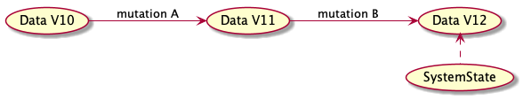
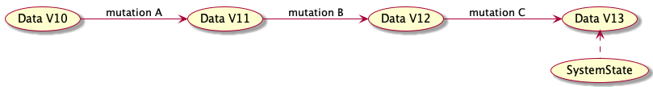
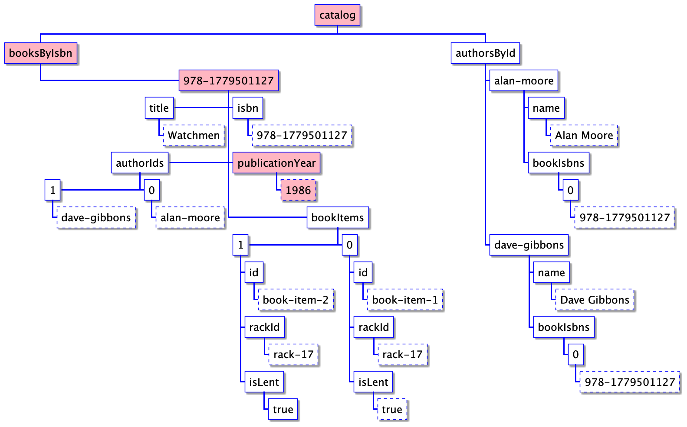
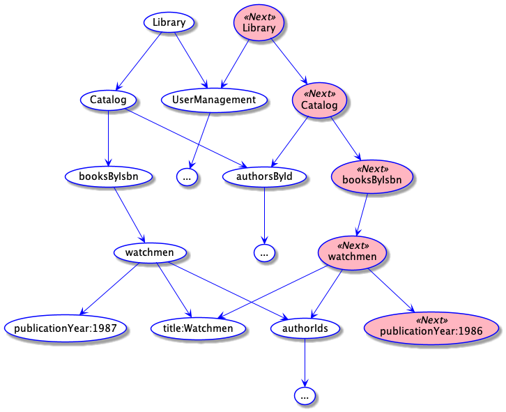
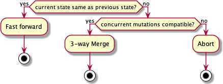
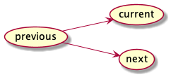
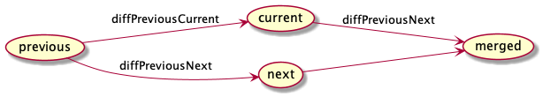

= Applying Git and Optimistic Concurrency Control principles to Data Oriented Programming
:page-layout: post
:includedir: _posts/data-book/code
:page-description: Applying Git and Optimistic Concurrency Control principles to Data Oriented Programming. Leverage structural sharing.
:page-guid: 0507E021-B84B-41C3-B89F-C1049ABF6E95
:page-thumbnail: assets/klipse.png
:page-categories: databook
:page-booktitle: Chapter 4
:page-bookorder: 04_01
:page-liquid:
:page-author: Yehonathan Sharvit
:page-date: 2020-12-18 08:21:24 +0200

++++

++++

== Introduction

So far in link:[the book], we have seen how Data Oriented Programming (DO) deals with requests that *query information* about the system, leveraging the representation of the whole system data as a *single nested hash map*.

In this chapter, we illustrate how DO deals with *mutations*, i.e. requests that *change* the *system state*. Mutations are inherently more complex than queries, especially in a *concurrent* system where mutations could conflict.

DO reduces significantly the complexity of mutations, by constraining the hash map that represents the system data to be *immutable*. We will see that in virtue of the immutability of the data, the code for a mutation is as *efficient* as the code for a query and we benefit from the same *power of expression* and *flexibility* as with queries.

DO manages concurrency using a lock free strategy called *Optimistic Concurrency Control*, that leads to *high throughput* of queries and mutations. The mutation logic is split into two distinct phases:

. The *Calculation phase* where we *compute* what would be the next state of the system if only this mutation were executed.
. The *Commit phase* where we *update* the state of the system taking into account possible *concurrent* mutations.

The code in both phases is made *efficient* in terms of *memory* and *computation* by ensuring that the data is *immutable*: Instead of mutating data in place, we create a new version of the data, leveraging a *structural sharing* algorithm.  As a consequence, the computation done in the Calculation phase is efficient and the comparison between two versions of the data for conflict resolution in the Commit phase is super fast.

== Optimistic Concurrency Control

[quote]
*Optimistic Concurrency Control* with *immutable* data is super *efficient*.

In DO, we manage different versions of the system data. At a specific point in time, the state of the system refers to a version of the system data. Each time a mutation is executed, we move forward the reference.

The data is *immutable* but the state reference is *mutable*.

Updating the state of the system is done inside a *commit* phase. The commit phase is responsible for *reconciling concurrent mutations* when they don't conflict or *aborting* the mutation.

image::../uml/chapter04/mutation-flow-icons.png[]

== Structural sharing

Structural sharing allows to *efficiently* create new versions of immutable data. In DO, we leverage *structural sharing* in the *calculation* phase of a *mutation* to compute the next state of the system based of the current state of the system. Inside the calculation phase, we don't have to deal with any concurrency control: this is delayed to the commit phase. As a consequence, the code involved in the calculation phase of a mutation remains *stateless* and is as simple as the code of a query.

Let's take a simple example from our library system: <<lib-data,a library>> with no users and a catalog with a single book: Watchmen.

[#lib-data]
[source,klipse-javascript]
----
include::{includedir}/chapter04/library-data.js[]
----

Imagine that we want to modify the value of a field in a book in the catalog, for instance the publication year of Watchmen.

[#library-information]

The information path for Watchmen publication year is: `["catalog", "booksByIsbn", "978-1779501127", "publicationYear"]`.

We are going to use the *immutable function* `_.set()` provided by link:[Lodash].

By default Lodash functions are not immutable. In order to use a immutable version of the functions, we need to use Lodash FP module (Functional Programming), as it is explained in the Lodash FP guide.footnote:[https://github.com/lodash/lodash/wiki/FP-Guide]. With this <<lodash-config,piece of code>> the signature of the immutable functions is exactly the same as the mutable functions.

[#lodash-config]
[source,klipse-javascript]
----
include::{includedir}/chapter04/lodash-config.js[]
----

Here is how we <<update-publication-year, write code >> that creates a version of the library data where the publication year of Watchmen is updated to 1986, with the *immutable function* `_.set()` provided by Lodash.

[#update-publication-year]
[source,klipse-javascript]
----
include::{includedir}/chapter04/update-publication-year.js[]
----

In the new version of the library, the publication year of Watchmen is 1986
[source,klipse-javascript]
----
include::{includedir}/chapter04/next-publication-year.js[]
----

However in the previous version of the library, the publication year of Watchmen is still 1987

[source,klipse-javascript]
----
include::{includedir}/chapter04/previous-publication-year.js[]
----

[quote]
A function is said to be *immutable* when instead of mutating the data, it creates a *new version* of the data without changing the data it receives. The immutable functions provided by Lodash are efficient because they use *structural sharing*.

Here is an illustration of how *structural sharing* works.

When you use an *immutable function* to create a new version of the `Library` where the publication year of Watchmen is set to 1986 (instead of 1987), it creates a fresh `Library` hash map that *recursively* uses the parts of the current `Library` that are *common* between the two versions instead of deeply copying them. This technique is called: *structural sharing*.

[#structural-sharing-a]

The next version of the `Library`, uses the same `UserManagement` hash map as the old one. The `Catalog` inside the next `Library` uses the same `authorsById` as the current `Catalog`. The Watchmen `Book` record inside the next `Catalog` uses all the fields of the current `Book` except for the `publicationYear` field.

As you can see by yourself, in `nextLibrary` the `authorsById` node is the exact same reference as in `library`

[source,klipse-javascript]
----
include::{includedir}/chapter04/same-same.js[]
----

We will see in a moment how we leverage this sharing of references to make the commit phase efficient.

[quote]
*Structural sharing* provides an *efficient* way (both *memory* and *computation*) to create a new version of the data by recursively sharing the parts that don't need to change.

== Persistent data structures

[quote]
*Persistent data structures* ensure the immutability of the data at the *level of the data structure* while immutable functions provide the immutability of the data at the level of the functions.

The way data is organized inside persistent data structures make them *more efficient* than immutable functions.

There are *libraries* providing persistent data structures in many languages: Immutable.js in JavaScript,footnote:[https://immutable-js.github.io/immutable-js/] Paguro in Java,footnote:[https://github.com/GlenKPeterson/Paguro] Immutable Collections in C#,footnote:[https://docs.microsoft.com/en-us/archive/msdn-magazine/2017/march/net-framework-immutable-collections] Pyrsistent in Python,footnote:[https://github.com/tobgu/pyrsistent] and Hamster in Ruby.footnote:[https://github.com/hamstergem/hamster]

The *drawback* of persistent data structures is that they are not native which means that working with them require *conversion* from native to persistent and from persistent to native.

That's one of the reasons why I love Clojure: the native data structures of the language are immutable!

== The reconciliation algorithm

[quote]
In a production system, multiple mutations run concurrently. Before updating the state, we need to reconcile.

*Reconciliation* between possible *concurrent mutations* is quite similar to what could happen in git when you push your changes to a branch and you discover that meanwhile the branch has moved forward because another developer has pushed her code to the branch.

Like in git, there are <<occ-merge,three possibilities to reconcile>> between possible concurrent mutations: fast forward, 3-way merge or abort.

[#occ-merge]

When the Commit phase of a mutation starts, we have <<three-versions,3 versions of the system state>>:

. `previous` - the version on which the Calculation phase based its computation
. `current` - the current version
. `next` - the version returned by the Calculation phase

[#three-versions]

If we are in a situation where the *current state is the same as the previous state*, it means that no mutations run concurrently. Therefore, like in git, we can safely *fast forward* and update the state of the system with the next version.

If the state has not remained the same, it means that mutations have run concurrently. We have to check for conflicts in a way similar to the *3-way merge* used by git. The difference is that instead of comparing lines, we compare fields of the system hash map.

We calculate the data diff between `previous` and `next` and between `previous` and `current`. If the two diffs are distinct, then there is no conflict between the mutations that have run concurrently. We can safely merge the changes from `previous` to `next` into `current`.

[#three-way-merge]
.In a 3-way merge, we calculate the diff between `previous` and `next` and we apply it to `current`

And if there is a conflict, we abort the mutation.

[quote]
In a user facing system, conflicting concurrent mutations are fairly rare: that's why it's OK to abort and let the user run the mutation again.

== The implementation of the Commit phase

The code for the Commit phase is made of 3 classes:

. `System`, a stateful class that implements the mutations
. `SystemData` a singleton stateful class
. `SystemConsistency`, a stateless class that provides conflict resolution logic

Let's start with the `System` class and how it <<add-member-mutation,implements>> the `addMember` mutation.

[#add-member-mutation]
[source,klipse-javascript]
----
include::{includedir}/chapter04/add-member-system.js[]
----

Here is the <<system-data,code>> for the `SystemData` class: It is the only stateful class in a DO system!

[#system-data]
[source,klipse-javascript]
----
include::{includedir}/chapter04/system-data-single-thread.js[]
----

And how does `SystemConsistency` do the reconciliation?

The `SystemConsistency` <<consistency,class>> starts the reconciliation process by comparing `previous` and `current`. If they are the same, then we fast-forward and return `next`.

[source.hidden,klipse-javascript]
----
include::{includedir}/chapter04/data-diff.js[]
----

[#consistency]
[source,klipse-javascript]
----
include::{includedir}/chapter04/consistency.js[]
----

The reconciliation algorithm relies on `DataDiff` class that implements the computation of a data diff between two hash maps and the detection of empty intersection. The internals of the `DataDiff` class are revealed in link:[Computing the data diff between two hash maps].

Have you noticed that we compare `previous` and `current` by reference instead of comparing them recursively *by value*? That's another *benefit of immutable data*: when the data is not mutated, it is safe to *compare references* and if they are the same, we know for sure that the data is the same.

Now, to the implementation of the 3-way merge algorithm.

When `previous` differs from `current`, it means that concurrent mutations have run. In order to determine whether there is a conflict or not, we calculate the two diffs: `previousToCurrent` and `previousToNext`. If the intersection between the two diffs is empty, it means there is not conflict. We merge `previousToNext` into `current`.

You may have noticed that think the <<consistency,code>> for the `Consistency` class is *not thread safe*! If there is a context switch between checking whether the system has changed in the `Consistency` class and the updating of the state in `SystemData` class, a mutation might override the changes of a previous mutation.

The code works fine in a single threaded environment like JavaScript where concurrency is handled via an *event loop*. However in a *multi threaded* environment, the code needs to be refined a bit and use atoms to be thread safe.

== Some examples

Let's make the reconciliation algorithm more concrete by giving an example of a reconciliation between non-conflicting concurrent mutations.

A mutation that updates the publication year of a book <<compatible-mutations,will not conflict>> with a mutation that updates the title of the same book. A reconciliation will result in a system state where both the title and the publication year are updated.

[#compatible-mutations]
[source,klipse-javascript]
----
include::{includedir}/chapter04/three-way-merge-example.js[]
----

The diff between `previous` and `current` is a nested map with <<diff-previous-current,a single field>> that holds the updated title.

[#diff-previous-current]
[source,klipse-javascript]
----
include::{includedir}/chapter04/diff-previous-current.js[]
----

And the diff between `previous` and `next` is also made of a <<diff-previous-next,single field>> for the updated publication year.

[#diff-previous-next]
[source,klipse-javascript]
----
include::{includedir}/chapter04/diff-previous-next.js[]
----

Now you see clearly how the code detects that the two mutations don't conflict: the two nested maps have no leaf in common!

The <<lib-data-reconciled,result of the reconciliation>> is a library where both the title and the publication year are updated.

[#lib-data-reconciled]
[source,klipse-javascript,highlight=7-8]
----
include::{includedir}/chapter04/library-data-reconciled.js[]
----

And here is an example of conflicting mutations: Two mutations that update the publication year of the same book <<incompatible-mutations,will conflict>>.

[#incompatible-mutations]
[source,klipse-javascript]
----
include::{includedir}/chapter04/conflicting-mutations.js[]
----

Here the two diffs contain the same field.

[source,klipse-javascript]
----
include::{includedir}/chapter04/data-diff-conflict.js[]
----
[source,klipse-javascript]
----
include::{includedir}/chapter04/data-diff-conflict-2.js[]
----

In that case, the reconciliation will fail.

== Wrapping up

In this chapter, we have explored how DO *manages state* with *Optimistic Concurrency Control*, where the mutation logic is split into Calculation and Commit phases.

During the *Calculation phase*, the data is manipulated with *immutable functions* that leverage *structural sharing* to create *efficiently* (memory and computation) a *new version* of the data where the data that is common between the two versions is shared.

*Conflict resolution* between *concurrent mutations* occur in the *Commit* phase. The code for the *commit phase* is common to all the mutations. The code that implements conflict detection in the commit phase is efficient in virtue of *structural sharing*.

++++

++++

++++

++++
