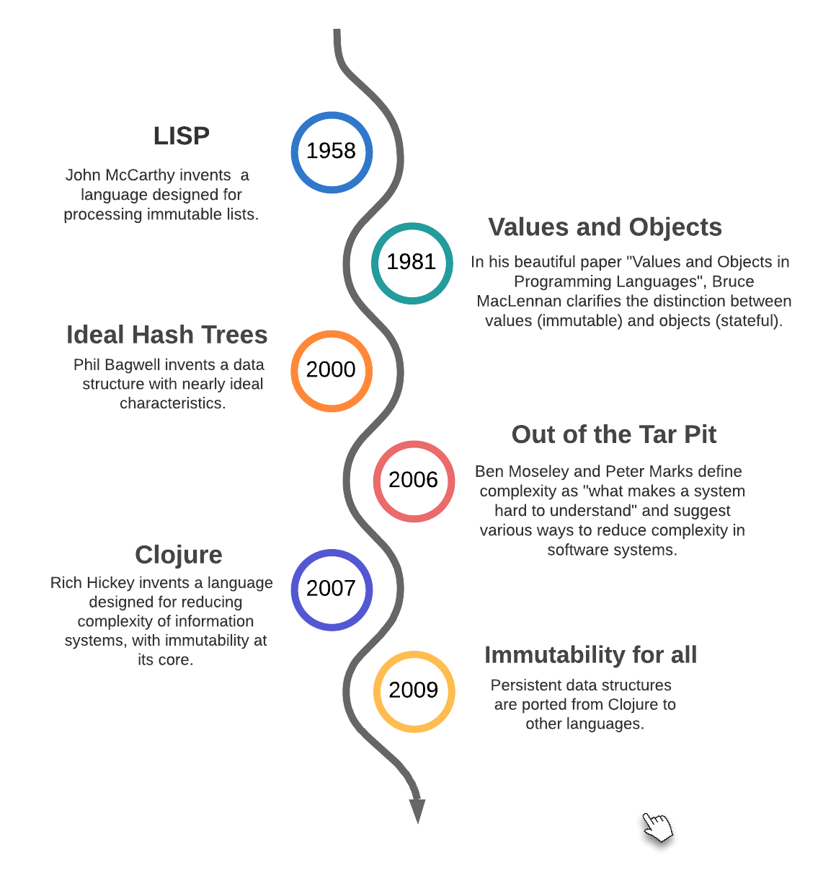

= Data-Oriented Programming: A link in the chain of programming paradigms
:page-layout: post
:page-description: Data-Oriented programming influences and how it compares with best practices from other programming paradigms.
:page-categories: databook
:page-thumbnail: assets/klipse.png
:page-liquid:
:page-author: Yehonathan Sharvit
:page-date:   2021-12-10 06:45:32 +0200
:page-tags: [dop]
:page-featured: true
:page-featured_image: /uml/dop-timeline.png

++++

++++

Data-Oriented Programming is not an invention. It has its *origins* in the 1950s and the invention of LISP and is based on a set of *best practices* that can be found in both Functional Programming and Object-Oriented Programming. However, this paradigm has only been applicable in production systems at scale since the 2010s and the implementation of *efficient* peristent data structures.

This article traces the major *ideas* and *discoveries* which, over the years, have allowed the emergence of DOP.

== Timeline 

==== 1958: LISP 

In LISP, John McCarthy has the ingenious idea to represent *data* as *generic immutable lists* and to invent a language that makes it very *natural* to create lists and to access any part of a list. That's the reason why LISP stands for LISt Processing.

In as sense, LISP lists are the ancestors of JavaScript object literals. The idea that it makes sense to represent data with generic data structures (DOP Principle #2) definitely comes from LISP.

The main limitation of LISP lists is that when we update a list, we need to create a new version of it by cloning it and it has a negative impact on *performances* both in terms of CPU and memory. 

==== 1981: Values and Objects

In a beautiful, short and easy-to-read paper named https://www.researchgate.net/publication/220177801_Values_and_Objects_in_Programming_Languages[Values and Objects in Programming Languages], Bruce MacLennan clarifies the distinction between *values* and *objects*. In a nutshell:

- Values are *timeless* abstractions for which the concepts of *updating*, *sharing* and *instantiation* have no meaning. For instance, numbers are values.
- Objects exist in *time* and hence can be *created*, *destroyed*, *copied*, *shared* and *updated*. For instance, an employee in a human resource software system is an object.

The meaning of the term _object_ in this paper is not exactly the same as in the context of Object-Oriented Programming.

The author explains why it's much simpler to write code that deals with values than code that deals with objects.

This paper has been a source of inspiration for Data-Oriented Programming as it encourages us to implement our systems in such a way that most of our code deals with values.  

==== 2000: Ideal Hash Trees

Phil Bagwell invented a data structure called Hash Array Mapped Trie (HAMT). In his paper https://lampwww.epfl.ch/papers/idealhashtrees.pdf[Ideal Hash trees], he used HAMT to implement hash maps with nearly ideal characteristics both in terms of *computation* and *memory* usage. 

HAMT and Ideal hash trees are the foundation of *efficient persistent data structures*.  

==== 2006: Out of the Tar Pit

In https://www.semanticscholar.org/paper/Out-of-the-Tar-Pit-Moseley-Marks/41dc590506528e9f9d7650c235b718014836a39d[Out of the Tar Pit], Ben Moseley and Peter Marks claim that *complexity* is the single major difficulty in the development of large-scale software systems. In the context of their paper, complexity means what make a system *hard to understand*.

The main insight of the authors is that most of the complexity of software systems in not essential but *accidental*: the complexity doesn't come from the problem we have to solve but from the software constructs we use to solve the problem. They suggest various ways to *reduce complexity* of software systems. 
 
In a sense, Data-Oriented Programming is a way to get us out of the tar pit.

==== 2007: Clojure

Rich Hickey, an *Object-Oriented* Programming expert, invented *Clojure* to make it easier to develop information systems at scale. Rich Hickey likes to summarize Clojure core value with the phrase: *"Just use maps!"*. By maps, he means *immutable* maps to be manipulated *efficiently* by *generic* functions. Those maps were implemented using the data structures presented by Phil Bagwell in "Ideal Hash Trees".

Clojure has been the main source of inspiration for Data-Oriented Programming. In a sense, Data-Oriented Programming is a formalization of the underlying principles of Clojure and how to apply them in other programming languages.

==== 2009: Immutability for all

Clojure's *efficient* implementation of *persistent data structures* has been attractive for developers from other programming langauges. In 2009, there were ported to Scala. Over the years, they have been *ported* to other *programming languages* either by organizations (like Facebook for Immutable.js) or by individual contributors (like Glen Peterson for Paguro in Java). 

Nowadays, DOP is applicable in virtually any programming language!

== DOP principles as best practices

The link:[principles of Data-Oriented programming are not new]. They come from *best practices* that are well-known among software developers from various programming languages. The _innovation_ of Data-Oriented programming is the combination of those principles into a cohesive whole.

In this section, we put each one of the 4 DOP principles into its broader scope.

==== Principle #1: Separate code from data

Separating code from data used to be the main point of *tension* between *Object-Oriented* Programming (OOP) and *Functional* Programming (FP). Traditionally, in OOP we *encapsulate* data together with code in *stateful* objects, while in FP we write *stateless* functions that receive data they manipulate as an *explicit* argument.

This tension has been reduced over the years as it is possible in FP to write stateful functions with data encapsulated in their https://en.wikipedia.org/wiki/Scope_computer_science[lexical scope]. Moreover, OOP languages like Java and C# have added support for *anonymous functions* (lambdas).

==== Principle #2: Represent data with generic data structures

One of the main innovation of *JavaScript* when it was released in December 1995 was the *easiness* to create and manipulate hash maps via *object literals*. The increasing *popularity* of JavaScript over the years as a language used everywhere (frontend, backend, desktop) has influenced the developer community to represent data with hash maps when possible. It feels more natural in *dynamically-typed* programming languages, it is applicable also in *statically-typed* programming languages.

==== Principle #3: Data is immutable

Data immutability is considered as a best practice as it makes the behaviour of our program more *predictable*. For instance, in https://www.oreilly.com/library/view/effective-java/9780134686097[Effective Java], Joshua Block mentions "Minimize mutability" as one of Java best practices. 

There is a famous quote from Alan Kay - who is considered by many as the inventor of Object-Oriented Programming - about the value of immutability:

> The last thing you wanted any programmer to do is mess with internal state even if presented figuratively. Instead, the objects should be presented as site of higher level behaviors more appropriate for use as dynamic components. (...) It is unfortunate that much of what is called "object-oriented programming" today is simply old style programming with fancier constructs. Many programs are loaded with "assignment-style" operations now done by more expensive attached procedures.

Unfortunately, until 2007 and the implementation of efficient persistent data structures in Clojure, immutability was not applicable for production applications at scale. 

Nowadays, efficient persistent data structures are available in most programming languages.

|===
| Language   | Library

| Java       | https://github.com/GlenKPeterson/Paguro[Paguro]
| C#         | https://docs.microsoft.com/en-us/archive/msdn-magazine/2017/march/net-framework-immutable-collections[Provided by the language]  
| JavaScript | https://immutable-js.com/[Immutable.js]
| Python     | https://github.com/tobgu/pyrsistent[Pyrsistent]
| Ruby       | https://github.com/hamstergem/hamster[Hamster]
|===

In addition to that, many languages provide support for *read-only* objects natively. Java added  https://docs.oracle.com/en/java/javase/14/docs/api/java.base/java/lang/Record.html[record classes] in Java 14. C# introduced a `record` type in C# 9. There is a (https://github.com/tc39/proposal-record-tuple)[ECMAScript proposal) for supporting immutable records and tuples in JavaScript . Python 3.7 introduced https://docs.python.org/3/library/dataclasses.html[Immutable data classes]. 

==== Principle #4: Separate data schema from data representation

One of the more virulent *critics* against dynamically-typed programming languages used to be related to the lack of data validation. The answer that dynamically-typed languages used to give to this critics was that you trade data *safety* for data *flexibility*. 

Since the development of *data schema* languages like https://json-schema.org/[JSON schema], it is natural to validate data even when data is represented as hash maps. 

== Wrapping up

In this article, we have explored the *ideas* that inspired Data-Oriented Programming and the *discoveries* that made it applicable in production systems at *scale* in most programming languages.

