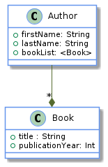
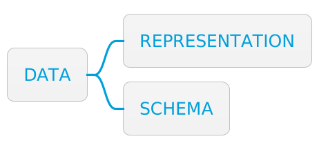

= Separate data schema from data representation
:page-layout: post
:page-description:  Principles of Data-Oriented Programming. Benefits and costs of Data-Oriented Programming. DOP vs OOP. DOP vs FP.
:page-thumbnail: assets/klipse.png
:page-liquid:
:page-categories: databook
:page-booktitle: Principle 4
:page-bookorder: 00_06
:page-author: Yehonathan Sharvit
:page-date:   2022-06-22 04:35:24 +0200
:page-tags: [dop]
:codedir: ../code/appendix-a
:underscore: _

With data separated from code and represented with generic and immutable data structures, now comes the question of how do we express the shape of the data? In DOP, the expected shape is expressed as a data schema that is kept separated from the data itself. The main benefit of Principle #4 is that it allows developers to decide which pieces of data should have a schema and which pieces of data should not.

++++

++++

++++

++++

This article is an exploration of the fourth principle of Data-Oriented Programming. The other principles of DOP are explored here:

* link:[Principle #1]: Separating code (behavior) from data.
* link:[Principle #2]: Representing data with generic data structures.
* link:[Principle #3]: Treating data as immutable.
* link:[Principle #4]: Separating data schema from data representation.

[quote]
_Principle #4_ -- Separate data schema from data representation.

== Illustration of Principle #4

Think about handling a request for the addition of an author to the system. To keep things simple, imagine that such a request contains only basic information about the author: their first name and last name and, optionally, the number of books they have written. As seen in Principle #2 (represent data with generic data structures), in DOP, request data is represented as a string map, where the map is expected to have three fields:

* `firstName` -- a string
* `lastName` -- a string
* `books` -- a number (optional)

In DOP, the expected shape of data is represented as data that is kept separate from the request data. For instance, JSON schema (https://json-schema.org/) can represent the data schema of the request with a map. The following listing provides an example.

[#add-author-request-schema-klipse-js,reftext="{chapter}.{counter:listing}"]
[source,klipse-javascript]
----
include::{codedir}/add-author-request-schema.js[]
----
<1> Data is expected to be a map (in JSON, a map is called an object).
<2> Only `firstName` and `lastName` fields are required.
<3> `firstName` must be a string.
<4> `lastName` must be a string.
<5> `books` must be a number (when it is provided).

A data validation library is used to check whether a piece of data conforms to a data schema. For instance, we could use Ajv JSON schema validator (https://ajv.js.org/) to validate data with the `validate` function that returns `true` when data is valid and `false` when data is invalid. The following listing shows this approach.

[#check-data-validity-klipse-js,reftext="{chapter}.{counter:listing}"]
[source,klipse-javascript]
----
include::{codedir}/check-data-validity.js[]
----
<1> Data is valid.
<2> Data has `lastNam` instead of `lastName`, and `books` is a string instead of a number.

When data is invalid, the details about data validation failures are available in a human readable format. The next listing shows this approach.

[#data-validation-errors-klipse-js,reftext="{chapter}.{counter:listing}"]
[source,klipse-javascript]
----
include::{codedir}/data-validation-errors.js[]
----
<1> By default, Ajv stores only the first data validation error. Set `allErrors: true` to store all errors.
<2> Data validation errors are stored internally as an array. In order to get a human readable string, use the `errorsText` function. 

== Benefits of Principle #4

Separation of data schema from data representation provides numerous benefits. The following sections describe these benefits in detail:

* Freedom to choose what data should be validated
* Optional fields
* Advanced data validation conditions
* Automatic generation of data model visualization

=== Benefit #1: Freedom to choose what data should be validated

When data schema is separated from data representation, we can instantiate data without specifying its expected shape. Such freedom is useful in various situations. For example,

* Rapid prototyping or experimentation
* Code refactoring and data validation

Consider rapid prototyping. In classic OOP, we need to instantiate every piece of data through a class. During the exploration phase of coding, when the final shape of our data is not yet known, being forced to update the class definition each time the data model changes slows us down. DOP enables a faster pace during the exploration phase by delaying the data schema definition to a later phase.

One common refactoring pattern is split phase refactoring (https://refactoring.com/catalog/splitPhase.html), where a single large function is split into multiple smaller functions with private scope. We call these functions, with data that has already been validated by the larger function. In DOP, it is not necessary to specify the shape of the arguments of the inner functions, relying on the data validation that has already occurred.

Consider how to display some information about an author, such as their full name and whether they are considered prolific. Using the code shown earlier to illustrate Principle #2 to calculate the full name and the prolificity level of the author, one might come up with a `displayAuthorInfo` function as the following listing shows. 

[#author-info-klipse-js,reftext="{chapter}.{counter:listing}"]
[source,klipse-javascript]
----
include::{codedir}/author-info.js[]
----

Notice that the first thing done inside the body of `displayAuthorInfo` is to validate that the argument passed to the function. Now, apply the split phase refactoring pattern to this simple example and split the body of `displayAuthorInfo` into two inner functions:

* `displayFullName` displays the author's full name.
* `displayProlificity` displays whether the author is prolific or not.

The next listing shows the resulting code.

[#author-info-refactored-klipse-js,reftext="{chapter}.{counter:listing}"]
[source,klipse-javascript]
----
include::{codedir}/author-info-refactored.js[]
----

Having the data schema separated from data representation eliminates the need to specify a data schema for the arguments of the inner functions `displayFullName` and `displayProlificity`. It makes the refactoring process a bit smoother. In some cases, the inner functions are more complicated, and it makes sense to specify a data schema for their arguments. DOP gives us the freedom to choose!

=== Benefit #2: Optional fields

In OOP, allowing a class member to be optional is not easy. For instance, in Java one needs a special construct like the `Optional` class introduced in Java 8 (http://mng.bz/4jWa). In DOP, it is natural to declare a field as optional in a map. In fact, in JSON Schema, by default, every field is optional. 

In order to make a field not optional, its name must be included in the `required` array as, for instance, in the author schema in the following listing, where only `firstName` and `lastName` are required, and `books` is optional. Notice that when an optional field is defined in a map, its value is validated against the schema.

[#author-schema-klipse-js,reftext="{chapter}.{counter:listing}"]
[source,klipse-javascript]
----
include::{codedir}/author-schema.js[]
----
<1> `books` is not included in `required` as it is an optional field.
<2> When present, `books` must be a number.

Let's illustrate how the validation function deals with optional fields. A map without a `books` field is considered to be valid: 

[#author-no-books-klipse-js,reftext="{chapter}.{counter:listing}"]
[source,klipse-javascript]
----
include::{codedir}/author-no-books.js[]
----
<1> The validation passes as `books` is an optional field.

Alternatively, a map with a `books` field, where the value is not a number, is considered to be invalid:

[#author-invalid-books-klipse-js,reftext="{chapter}.{counter:listing}"]
[source,klipse-javascript]
----
include::{codedir}/author-invalid-books.js[]
----
<1> The validation fails as `books` is not a number.

=== Benefit #3: Advanced data validation conditions

In DOP, data validation occurs at run time. It allows the definition of data validation conditions that go beyond the type of a field. For example, validating that a field is not only a string, but a string with a maximal number of characters or a number comprised in a range of numbers as well. 

JSON Schema supports many other advanced data validation conditions such as regular expression validation for string fields or number fields that should be a multiple of a given number. The author schema in the following listing expects `firstName` and `lastName` to be strings of less than 100 characters, and `books` to be a number between 0 and 10,000.

[#author-schema-complex-klipse-js,reftext="{chapter}.{counter:listing}"]
[source,klipse-javascript]
----
include::{codedir}/author-schema-complex.js[]
----

=== Benefit #4: Automatic generation of data model visualization

With the data schema defined as data, we can use several tools to generate data model visualizations. With tools like JSON Schema Viewer (https://navneethg.github.io/jsonschemaviewer/) and Malli (https://github.com/metosin/malli), a UML diagram can be generated from a JSON schema. 

For instance, the JSON schema in the following listing defines the shape of a `bookList` field, which is an array of books where each book is a map, and in the following figure, it is visualized as a UML diagram. These tools generate the UML diagram from the JSON schema.

[#author-schema-visualize,reftext="{chapter}.{counter:listing}"]
[source,json]
----
include::{codedir}/author-schema-visualize.json[]
----

[#author-schema-uml,reftext="{chapter}.{counter:figure}"]

== Cost for Principle #4

Applying Principle #4 comes with a price. The following sections look at these costs:

* Weak connection between data and its schema
* Small performance hit 

=== Cost #1: Weak connection between data and its schema

By definition, when data schema and data representation are separated, the connection between data and its schema is weaker that when data is represented with classes. Moreover, the schema definition language (e.g., JSON Schema) is not part of the programming language. It is up to the developer to decide where data validation is necessary and where it is superfluous. As the idiom says, with great power comes great responsibility.

=== Cost #2: Light performance hit

As mentioned earlier, there exist implementations of JSON schema validation in most programming languages. In DOP, data validation occurs at run time, and it takes some time to run the data validation. In OOP, data validation occurs usually at compile time.

This drawback is mitigated by the fact that, even in OOP, some parts of data validation occur at run time. For instance, the conversion of a request JSON payload into an object occurs at run time. Moreover, in DOP, it is quite common to have some data validation parts enabled only during development and to disable them when the system runs in production. As a consequence, this performance hit is not significant.

== Summary of Principle #4

In DOP, data is represented with immutable generic data structures. When additional information about the shape of the data is required, a data schema can be defined (e.g., using JSON Schema). Keeping the data schema separate from the data representation gives us the freedom to decide where data should be validated. 

Moreover, data validation occurs at run time. As a consequence, data validation conditions that go beyond the static data types (e.g., the string length) can be expressed. However, with great power comes great responsibility, and it is up to the developer to remember to validate data.

*DOP Principle #4: Separate between data schema and data representation*

To adhere to this principle, separate between data schema and data representation. 

Benefits include

* Freedom to choose what data should be validated
* Optional fields
* Advanced data validation conditions
* Automatic generation of data model visualization

The cost for implementing Principle #4 includes

* Weak connection between data and its schema
* A small performance hit 

++++

++++

