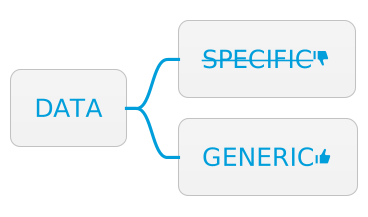

= Represent data with generic data structures
:page-layout: post
:page-description: Benefits and costs of representing data with generic data structures.
:page-thumbnail: assets/klipse.png
:page-liquid:
:page-categories: databook
:page-booktitle: Principle 2
:page-bookorder: 00_04
:page-author: Yehonathan Sharvit
:page-date:   2022-06-22 04:33:24 +0200
:page-tags: [dop]
:codedir: ../code/appendix-a
:underscore: _

When adhering to link:[Principle #1 of DOP], code is separated from data. DOP is not opinionated about the programming constructs to use for organizing the code, but it has a lot to say about how the data should be represented. This is the theme of Principle #2.

The most common generic data structures are maps (a.k.a. dictionaries) and arrays (or lists). But other generic data structures (e.g., sets, trees, and queues) can be used as well. Principle #2 does not deal with the mutability or the immutability of the data. That is the theme of Principle #3.

++++

++++

++++

++++

This article is an exploration of the second principle of Data-Oriented Programming. The other principles of DOP are explored here:

* link:[Principle #1]: Separating code (behavior) from data.
* link:[Principle #2]: Representing data with generic data structures.
* link:[Principle #3]: Treating data as immutable.
* link:[Principle #4]: Separating data schema from data representation.

[quote]
_Principle #2_ -- Represent application data with generic data structures.

== Illustration of Principle #2

In DOP, data is represented with generic data structures (like maps and arrays) instead of instantiating data via specific classes. In fact, most of the data entities that appear in a typical application can be represented with maps and arrays (or lists). But there exist other generic data structures (e.g., sets, lists, queues, etc.) that might be required in some use cases. Let's look at the same simple example we used to illustrate link:[Principle #1] (data that represents an author).

An author is a data entity with a `firstName`, a `lastName`, and the number of `books` they have written. Principle #2 is broken when we use a specific class to represent an author as this listing reveals.

[#break-2-oop-klipse-js,reftext="{chapter}.{counter:listing}"]
[source, klipse-javascript]
----
include::{codedir}/breaking-2-oo.js[]
----

Principle #2 is followed when using a map (a dictionary or an associative array) as a generic data structure that represents an author. The following listing illustrates how we can follow this principle in OOP.

[#follow-2-oop-klipse-js,reftext="{chapter}.{counter:listing}"]
[source,klipse-javascript]
----
include::{codedir}/following-2-oo.js[]
----

In a language like JavaScript, we can also instantiate a map via a data literal, which is a bit more convenient. The following listing shows an example.

[#follow-2-literal-klipse-js,reftext="{chapter}.{counter:listing}"]
[source,klipse-javascript]
----
include::{codedir}/following-2-literal.js[]
----

== Benefits of Principle #2

Using generic data structures to represent data has multiple benefits. We cover these benefits in greater detail in the following sections:

* The ability to use generic functions that are not limited to our specific use case
* A flexible data model

=== Using functions that are not limited to a specific use case

Using generic data structures to represent data makes it possible to manipulate data with a rich set of functions that are available on those data structures natively in our programming language. Additionally, third-party libraries also provide more of these functions. For instance, JavaScript natively provides some basic functions on maps and arrays, and third-party libraries like Lodash (https://lodash.com/) extend the functionality with even more functions. There is a famous quote by Alan Perlis that summarizes this benefit:

[quote]
____
It is better to have 100 functions operate on one data structure than to have 10 functions operate on 10 data structures.
____

When an author is represented as a map, the author can be serialized into JSON using `JSON.stringify()`, which is part of JavaScript. The following listing provides an example.

[source, klipse-javascript]
----
include::{codedir}/serialize-free.js[]
----

Serializing author data without the number of books can be accomplished via Lodash's `{underscore}.pick()` function. The following listing uses `{underscore}.pick()` to create an object with a subset of keys. 

[source, klipse-javascript]
----
include::{codedir}/manipulate-generic.js[]
----

[quote]
When adhering to Principle #2, a rich set of functionality is available for data manipulation.

=== Flexible data model

When using generic data structures, the data model is flexible, and data is not forced into a specific shape. Data can be created with no predefined shape, and its shape can be modified at will.

In classic OOP, when _not_ adhering to Principle #2, each piece of data is instantiated via a class and must follow a rigid shape. When a slightly different data shape is needed, a new class must be defined. Take, for example, `AuthorData`, a class that represents an author entity made of three fields: `firstName`, `lastName`, and `books`. Suppose that you want to add a field called `fullName` with the full name of the author. If we fail to adhere to Principle #2, a new class `AuthorDataWithFullName` must be defined. However, when using generic data structures, fields can be added to (or removed from) a map _on the fly_ as the following listing shows.

[#fly-klipse-js,reftext="{chapter}.{counter:listing}"]
[source,klipse-javascript]
----
include::{codedir}/add-on-the-fly.js[]
----

[quote]
Working with a flexible data model is particularly useful in applications where the shape of the data tends to be dynamic (e.g., web apps and web services).

Part 1 of my book explores in detail the benefits of a flexible data model in real-world applications. Next, let's explore the cost for adhering to Principle #2.

== Cost for Principle #2
As with any programming principle, using this principle comes with its own set of trade-offs. The price paid for representing data with generic data structures is as follows:

* There is a slight performance hit.
* No data schema is required.
* No compile-time check that the data is valid is necessary.
* In some statically typed languages, type casting is needed.

=== Cost #1: Performance hit

When specific classes are used to instantiate data, retrieving the value of a class member is fast because the compiler knows how the data will look and can do many optimizations. With generic data structures, it is harder to optimize, so retrieving the value associated to a key in a map, for example, is a bit slower that retrieving the value of a class member. Similarly, setting the value of an arbitrary key in a map is a bit slower that setting the value of a class member. In most programming languages, this performance hit is not significant, but it is something to keep in mind.

[quote]
Retrieving and storing the value associated to an arbitrary key from a map is a bit slower than with a class member.

=== Cost #2: No data schema

When data is instantiated from a class, the information about the data shape is in the class definition. Every piece of data has an associated data shape. The existence of data schema at a class level is useful for developers and for IDEs because

* Developers can easily discover the expected data shape.
* IDEs provide features like field name autocompletion.

When data is represented with generic data structures, the data schema is not part of the data representation. As a consequence, some pieces of data might have an associated data schema and other pieces of data do not (see Principle #4).

[quote]
When generic data structures are used to store data, the data shape is not part of the data representation. 

=== Cost #3: No compile-time check that the data is valid

Look again at the `fullName` function in the following listing, which was created to explore Principle #1. This function receives the data it manipulates as an argument.

[#fullname-klipse-js,reftext="{chapter}.{counter:listing}"]
[source,klipse-javascript]
----
include::{codedir}/receive-data.js[]
----

When data is passed to `fullName` that does not conform to the shape `fullName` expects, an error occurs at run time. With generic data structures, mistyping the field storing the first name (e.g., `fistName` instead of `firstName`) does not result in a compile-time error or an exception. Rather, `firstName` is mysteriously omitted from the result. The following listing shows this unexpected behavior.

[#weird-behavior-klipse-js,reftext="{chapter}.{counter:listing}"]
[source,klipse-javascript]
----
include::{codedir}/not-conforming.js[]
----

When we instantiate data via classes with a rigid data shape, this type of error is caught at compile time. This drawback is mitigated by the application of Principle #4 that deals with data validation.

[quote]
When data is represented with generic data structures, data shape errors are caught only at run time.

=== Cost #4: The need for explicit type casting
In some statically typed languages, explicit type casting is needed. This section takes a look at explicit type casting in Java and at dynamic fields in C#.

In a statically typed language like Java, author data can be represented as a map whose keys are of type `string` and whose values are of types `Object`. For example, in Java, author data is represented by a `Map<String, Object>` as the following listing illustrates.

[#author-data-java,reftext="{chapter}.{counter:listing}"]
[source, java]
----
include::{codedir}/author-data.java[]
----

Because the information about the exact type of the field values is not available at compile time, when accessing a field, an explicit type cast is required. For instance, in order to check whether an author is prolific, the value of the `books` field must be type cast to an integer as this listing shows.

[#is-prolific-java,reftext="{chapter}.{counter:listing}"]
[source, java]
----
include::{codedir}/is-prolific.java[]
----

Some Java JSON serialization libraries like Gson (https://github.com/google/gson) support serialization of maps of type `Map<String, Object>`, without requiring the user to do any type casting. All the magic happens behind the scenes!

C# supports a dynamic data type called `dynamic` (see http://mng.bz/voqJ), which allows type checking to occur at run time. Using this feature, author data is represented as a dictionary, where the keys are of type `string`, and the values are of type `dynamic`. The next listing provides this representation.

[#author-data-cs,reftext="{chapter}.{counter:listing}"]
[source, csharp]
----
include::{codedir}/author-data.cs[]
----

The information about the exact type of the field values is resolved at run time. When accessing a field, no type cast is required. For instance, when checking whether an author is prolific, the `books` field can be accessed as though it were declared as an integer as in this listing.

[#is-prolific-cs,reftext="{chapter}.{counter:listing}"]
[source, csharp]
----
include::{codedir}/is-prolific.cs[]
----

== Summary 

DOP uses generic data structures to represent data. This might cause a (small) performance hit and impose the need to manually document the shape of data because the compiler cannot validate it statically. Adherence to this principle enables the manipulation of data with a rich set of generic functions (provided by the language and by third-party libraries). Additionally, our data model is flexible. At this point, the data can be either mutable or immutable. The link:[next principle] illustrates the value of immutability.

*DOP Principle #2: Represent data with generic data structures*

To comply to this principle, we represent application data with generic data structures, mostly maps and arrays (or lists). The following figure provides a diagram as a visual representation of this principle.

Benefits include

* Using generic functions that are not limited to our specific use case
* A flexible data model

The cost for implementing this principle includes

* There is a slight performance hit.
* No data schema is required.
* No compile time check that the data is valid is necessary.
* In some statically typed languages, explicit type casting is needed.

