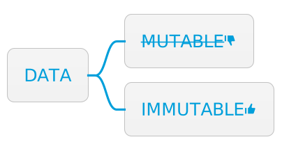

= Data is immutable
:page-layout: post
:page-description:  Benefits and costs of immutable data.
:page-thumbnail: assets/klipse.png
:page-liquid:
:page-categories: databook
:page-booktitle: Principle 3
:page-bookorder: 00_05
:page-author: Yehonathan Sharvit
:page-date:   2022-06-22 04:34:24 +0200
:page-tags: [dop]
:codedir: ../code/appendix-a
:underscore: _

With data separated from code and represented with generic data structures, how are changes to the data managed? DOP is very strict on this question. Mutation of data is not allowed! In DOP, changes to data are accomplished by creating new versions of the data. The _reference_ to a variable may be changed so that it refers to a new version of the data, but the _value_ of the data itself must never change.

++++

++++

++++

++++

This article is an exploration of the third principle of Data-Oriented Programming. The other principles of DOP are explored here:

* link:[Principle #1]: Separating code (behavior) from data.
* link:[Principle #2]: Representing data with generic data structures.
* link:[Principle #3]: Treating data as immutable.
* link:[Principle #4]: Separating data schema from data representation.

[quote]
_Principle #3_ -- Data is immutable.

== Illustration of Principle #3

Think about the number 42. What happens to 42 when you add 1 to it? Does it become 43? No, 42 stays 42 forever! Now, put 42 inside an object: `{num: 42}`. What happens to the object when you add 1 to 42? Does it become 43? It depends on the programming language.

* In Clojure, a programming language that embraces data immutability, the value of the `num` field stays `42` forever, no matter what.
* In many programming languages, the value of the `num` field becomes `43`.

For instance, in JavaScript, mutating the field of a map referred by two variables has an impact on both variables. The following listing demonstrates this.

[#mutating-data-klipse-js,reftext="{chapter}.{counter:listing}"]
[source, klipse-javascript]
----
include::{codedir}/mutating-in-place.js[]
----

Now, `myData.num` equals `43`. According to DOP, however, data should never change! Instead of mutating data, a new version of it is created. A naive (and inefficient) way to create a new version of a data is to clone it before modifying it. For instance, in the following listing, there is a function that changes the value of a field inside an object by cloning the object via `Object.assign`, provided natively by JavaScript. When `changeValue` is called on `myData`, `myData` is not affected; `myData.num` remains `42`. This is the essence of data immutability!

[#cloning-klipse-js,reftext="{chapter}.{counter:listing}"]
[source,klipse-javascript]
----
include::{codedir}/mutating-via-cloning.js[]
----

Embracing immutability in an efficient way, both in terms of computation and memory, requires a third-party library like Immutable.js (https://immutable-js.com/), which provides an efficient implementation of persistent data structures (a.k.a. immutable data structures). In most programming languages, there exist libraries that provide an efficient implementation of persistent data structures.

With `Immutable.js`, JavaScript native maps and arrays are not used, but rather, immutable maps and immutable lists instantiated via `Immutable.Map` and `Immutable.List`. An element of a map is accessed using the `get` method. A new version of the map is created when a field is modified with the `set` method. 

Here is how to create and manipulate immutable data efficiently with a third-party library. In the output, `yourData.get("num")` is `43`, but `myData.get("num")` remains `42`.

[#immutable-js-klipse-js,reftext="{chapter}.{counter:listing}"]
[source,klipse-javascript]
----
include::{codedir}/mutating-via-immutable.js[]
----

[quote]
When data is immutable, instead of mutating data, a new version of it is created.

== Benefits of Principle #3

When programs are constrained from mutating data, we derive benefit in numerous ways. The following sections detail these benefits:

* Data access to all with confidence
* Predictable code behavior
* Fast equality checks
* Concurrency safety for free

=== Benefit #1: Data access to all with confidence
According to Principle #1 (separate code from data), data access is transparent. Any function is allowed to access any piece of data. Without data immutability, we must be careful when passing data as an argument to a function. We can either make sure the function does not mutate the data or clone the data before it is passed to the function. When adhering to data immutability, none of this is required.

[quote]
When data is immutable, it can be passed to any function with confidence because data never changes.

=== Benefit #2: Predictable code behavior

As an illustration of what is meant by _predictable_, here is an example of an _unpredictable_ piece of code that does not adhere to data immutability. Take a look at the piece of asynchronous JavaScript code in the following listing. When data is mutable, the behavior of asynchronous code is not predictable.

[#async-js,reftext="{chapter}.{counter:listing}"]
[source,klipse-javascript]
----
include::{codedir}/unpredictable-async.js[]
----

The value of `data.num` inside the timeout callback is not predictable. It depends on whether the data is modified by another piece of code during the 1,000 ms of the timeout. However, with immutable data, it is guaranteed that data never changes and that `data.num` is always `42` inside the callback.

[quote]
When data is immutable, the behavior of code that manipulates data is predictable.

=== Benefit #3: Fast equality checks

With UI frameworks like React.js, there are frequent checks to see what portion of the UI data has been modified since the previous rendering cycle. Portions that did not change are not rendered again. In fact, in a typical frontend application, most of the UI data is left unchanged between subsequent rendering cycles. 

In a React application that does not adhere to data immutability, it is necessary to check every (nested) part of the UI data. However, in a React application that follows data immutability, it is possible to optimize the comparison of the data for the case where data is not modified. Indeed, when the object address is the same, then it is certain that the data did not change.

Comparing object addresses is much faster than comparing all the fields. In Part 1 of my book, fast equality checks are used to reconcile between concurrent mutations in a highly scalable production system.

[quote]
Immutable data enables fast equality checks by comparing data by reference.

=== Benefit #4: Free concurrency safety

In a multi-threaded environment, concurrency safety mechanisms (e.g., mutexes) are often used to prevent the data in thread `A` from being modified while it is accessed in thread `B`. In addition to the slight performance hit they cause, concurrency safety mechanisms impose a mental burden that makes code writing and reading much more difficult.

[quote]
Adherence to data immutability eliminates the need for a concurrency mechanism. The data you have in hand never changes!

== Cost for Principle #3

As with the previous principles, applying Principle #3 comes at a price. The following sections look at these costs:

* Performance hit
* Required library for persistent data structures

=== Cost #1: Performance hit

As mentioned earlier, there exist implementations of persistent data structures in most programming languages. But even the most efficient implementation is a bit slower than the in-place mutation of the data. In most applications, the performance hit and the additional memory consumption involved in using immutable data structures is not significant. But this is something to keep in mind.

=== Cost #2: Required library for persistent data structures

In a language like Clojure, the native data structures of the language are immutable. However, in most programming languages, adhering to data immutability requires the inclusion a third-party library that provides an implementation of persistent data structures.

The fact that the data structures are not native to the language means that it is difficult (if not impossible) to enforce the usage of immutable data across the board. Also, when integrating with third-party libraries (e.g., a chart library), persistent data structures must be converted into equivalent native data structures.

== Summary of Principle #3

DOP considers data as a value that never changes. Adherence to this principle results in code that is predictable even in a multi-threaded environment, and equality checks are fast. However, a non-negligible mind shift is required, and in most programming languages, a third-party library is needed to provide an efficient implementation of persistent data structures.

*DOP Principle #3: Data is immutable*

To adhere to this principle, data is represented with immutable structures. 

Benefits include

* Data access to all with confidence
* Predictable code behavior
* Fast equality checks
* Concurrency safety for free

The cost for implementing Principle #3 includes

* A performance hit
* Required library for persistent data structures

++++

++++

