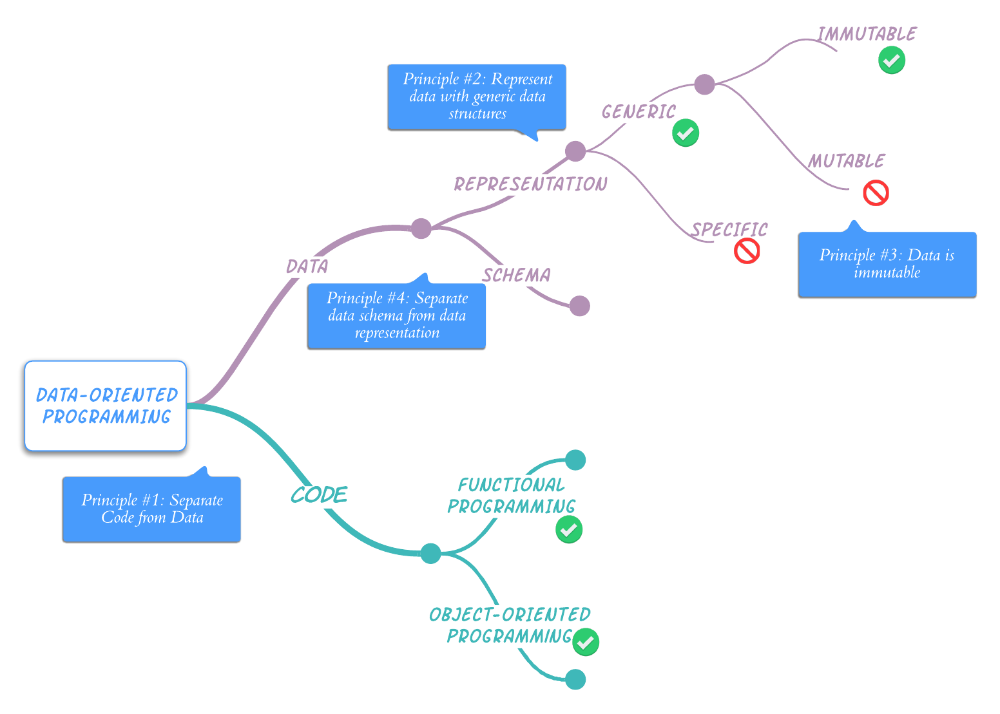

= Principles of Data-Oriented Programming
:page-layout: post
:page-description:  Principles of Data-Oriented Programming. Benefits and costs of Data-Oriented Programming. DOP vs OOP. DOP vs FP.
:page-thumbnail: assets/klipse.png
:page-liquid:
:page-booktitle: Appendix A
:page-categories: databook
:page-bookorder: 00_02
:page-categories: dop
:page-author: Yehonathan Sharvit
:page-date:   2022-06-22 04:31:24 +0200
:page-featured_image: uml/chapter00/do-principles-mind-map.png
:page-featured: true
:page-tags: [dop]
:codedir: ../code/appendix-a
:underscore: _

++++

++++

Now that my book is completed, I have a better understanding of the core principles of Data-Oriented Programming. This article is a rewrite of link:[my previous article] about DOP Principles from September 2020. 

Data-oriented programming (DOP) is a programming paradigm aimed at simplifying the design and implementation of software systems, where information is at the center in systems such as frontend or backend web applications and web services, for example. Instead of designing information systems around software constructs that combine code and data (e.g., objects instantiated from classes), DOP encourages the _separation_ of code from data. Moreover, DOP provides guidelines about how to represent and manipulate data.

[quote]
In DOP, data is treated as a first-class citizen.

The essence of DOP is that it treats data as a first-class citizen. It gives developers the ability to manipulate data inside a program with the same simplicity as they manipulate numbers or strings. Treating data as a first-class citizen is made possible by adhering to four core principles:

* link:[Principle #1]: Separating code (behavior) from data.
* link:[Principle #2]: Representing data with generic data structures.
* link:[Principle #3]: Treating data as immutable.
* link:[Principle #4]: Separating data schema from data representation.

When these four principles are combined, they form a cohesive whole. Systems built using DOP are simpler and easier to understand, so the developer experience is significantly improved.

[#combined-together,reftext="{chapter}.{counter:figure}"]

[quote]
In a data-oriented system, code is separated from data. Data is represented with generic data structures that are immutable and have a separate schema.

Notice that DOP principles are language-agnostic. They can be adhered to (or broken) in

* Object-oriented programming (OOP) languages such as Java, C#, C++, etc.
* Functional programming (FP) languages such as Clojure, OCaml, Haskell, etc.
* Languages that support both OOP and FP such as JavaScript, Python, Ruby, Scala, etc.

This series of articles succinctly illustrates how those principles could be applied or broken in JavaScript. Mentioned briefly are the benefits of adherence to each principle, and the costs paid to enjoy those benefits. This article also illustrates the principles of DOP via simple code snippets. Throughout my book link:https://www.manning.com/books/data-oriented-programming?utm_source=viebel&utm_medium=affiliate&utm_campaign=book_sharvit2_data_1_29_21&a_aid=viebel&a_bid=d5b546b7[Data-Oriented Programming], the application of DOP principles to production information systems is explored in depth.

== Principle #1: Separate code from data

Principle #1 is a design principle that recommends a clear separation between code (behavior) and data. This may appear to be a FP principle, but in fact, one can adhere to it or break it either in FP or in OOP:

* Adherence to this principle in OOP means aggregating the code as methods of a static class.
* Breaking this principle in FP means hiding state in the lexical scope of a function.

Also, this principle does not relate to the way data is represented. Data representation is addressed by Principle #2.

This principle is explored further in link:[Separate code from data].

== Principle #2: Represent data with generic data structures

When adhering to Principle #1, code is separated from data. DOP is not opinionated about the programming constructs to use for organizing the code, but it has a lot to say about how the data should be represented. This is the theme of Principle #2.

The most common generic data structures are maps (a.k.a. dictionaries) and arrays (or lists). But other generic data structures (e.g., sets, trees, and queues) can be used as well. Principle #2 does not deal with the mutability or the immutability of the data. That is the theme of Principle #3.

This principle is explored further in link:[Represent data with generic data structures].

== Principle #3: Data is immutable

With data separated from code and represented with generic data structures, how are changes to the data managed? DOP is very strict on this question. Mutation of data is not allowed! In DOP, changes to data are accomplished by creating new versions of the data. The _reference_ to a variable may be changed so that it refers to a new version of the data, but the _value_ of the data itself must never change.

This principle is explored further in link:[Data is immutable].

== Principle #4: Separate data schema from data representation

With data separated from code and represented with generic and immutable data structures, now comes the question of how do we express the shape of the data? In DOP, the expected shape is expressed as a data schema that is kept separated from the data itself. The main benefit of Principle #4 is that it allows developers to decide which pieces of data should have a schema and which pieces of data should not.

This principle is explored further in link:[Separate data schema from data representation].

== Conclusion

DOP simplifies the design and implementation of information systems by treating data as a first-class citizen. This is made possible by adhering to four language agnostic core principles:

* Separating code from data.
* Representing application data with generic data structures.
* Treating data as immutable.
* Separating data schema from data representation.

[#core-principles,reftext="{chapter}.{counter:figure}"]

++++

++++

