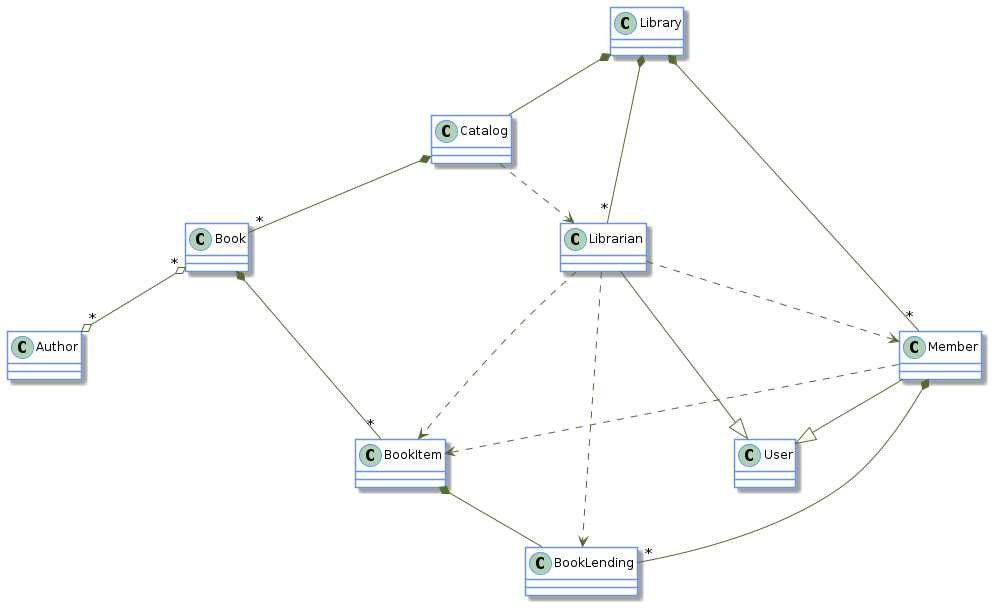
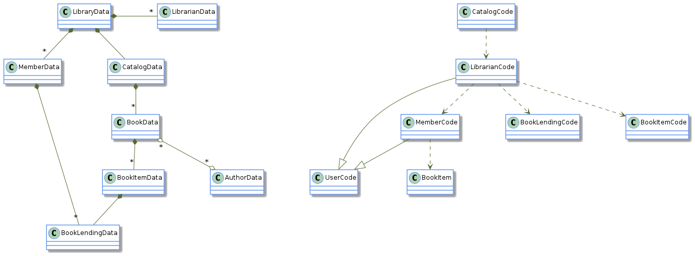
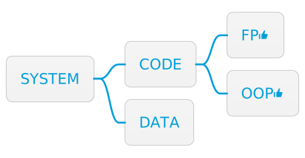

= Separate code from data
:page-layout: post
:page-description: Benefits and costs of separating code from data in Data-Oriented Programming. Drawbacks of encapsulation in Object-Oriented Programming.
:page-thumbnail: assets/klipse.png
:page-liquid:
:page-categories: databook
:page-booktitle: Principle 1
:page-bookorder: 00_03
:page-author: Yehonathan Sharvit
:page-date:   2022-06-22 04:32:24 +0200
:page-tags: [dop]
:codedir: ../code/appendix-a
:underscore: _
:sharp: #

The first principle of Data-Oriented Programming (DOP) is a design principle that recommends a clear separation between code (behavior) and data. This may appear to be a FP principle, but in fact, one can adhere to it or break it either in FP or in OOP:

* Adherence to this principle in OOP means aggregating the code as methods of a static class.
* Breaking this principle in FP means hiding state in the lexical scope of a function.

Also, this principle does not relate to the way data is represented. Data representation is addressed by link:[Principle #2: Represent data with generic data structures].

++++

++++

This article is an exploration of the first principle of Data-Oriented Programming. The other principles of DOP are explored here:

* link:[Principle #1]: Separating code (behavior) from data.
* link:[Principle #2]: Representing data with generic data structures.
* link:[Principle #3]: Treating data as immutable.
* link:[Principle #4]: Separating data schema from data representation.

[quote]
_Principle #1_ -- Separate code from data in a way that the code resides in functions whose behavior does not depend on data that is encapsulated in the function's context.

== Illustration of Principle #1

Our exploration of Principle #1 begins by illustrating how it can be applied to OOP and FP. The following sections illustrate how this principle can be adhered to or broken in a simple program that deals with:

* An author entity with a `firstName`, a `lastName`, and the number of `books` they wrote.
* A piece of code that calculates the full name of the author.
* A piece of code that determines if an author is prolific, based on the number of books they wrote.

=== Breaking Principle #1 in OOP

Breaking Principle #1 in OOP happens when we write code that combines data and code together in an object. The following listing demonstrates what this looks like.

[#break-1-oop-klipse-js,reftext="{chapter}.{counter:listing}"]
[source, klipse-javascript]
----
include::{codedir}/breaking-1-oo.js[]
----
<1> Isaac Asimov really wrote around 500 books!

=== Breaking Principle #1 in FP

Breaking this principle without classes in FP means hiding data in the lexical scope of a function. The next listing provides an example of this.

[#break-1-fp-klipse-js,reftext="{chapter}.{counter:listing}"]
[source, klipse-javascript]
----
include::{codedir}/breaking-1-fp.js[]
----

=== Adhering to Principle #1 in OOP

The following listing shows an example that adheres to Principle #1 in OOP. Compliance with this principle may be achieved even with classes by writing programs such that:

* The code consists of static methods.
* The data is encapsulated in data classes (classes that are merely containers of data).

[#compliant-1-oop-klipse-js,reftext="{chapter}.{counter:listing}"]
[source, klipse-javascript]
----
include::{codedir}/following-1-oo.js[]
----

=== Adhering to Principle #1 in FP

Here is an example that adheres to Principle #1 in FP. Compliance with this principle means separating code from data.

[#compliant-1-fp-klipse-js,reftext="{chapter}.{counter:listing}"]
[source,klipse-javascript]
----
include::{codedir}/following-1-fp.js[]
----

== Benefits of Principle #1

Having illustrated how to follow or break Principle #1 both in OOP and FP, let's look at the benefits that Principle #1 brings to our programs. Careful separation of code from data benefits our programs in the following ways:

* Code can be reused in different contexts.
* Code can be tested in isolation.
* Systems tend to be less complex.

=== Benefit #1: Code can be reused in different contexts

Imagine that besides the author entity, there is a user entity that has nothing to do with authors but has two of the same data fields as the author entity: `firstName` and `lastName`. The logic of calculating the full name is the same for authors and users -- retrieving the values of two fields with the same names. However, in traditional OOP as in the version with `createAuthorObject` in listing below, the code of `fullName` cannot be reused on a user in a _straightforward_ way because it is locked inside the `Author` class.

[#full-name-oo-klipse-js,reftext="{chapter}.{counter:listing}"]
[source, klipse-javascript]
----
include::{codedir}/full-name-oo.js[]
----

One way to achieve code re-usability when code and data are mixed is to use OOP mechanisms like inheritance or composition to let the `User` and `Author` classes use the same `fullName` method. These techniques are adequate for simple use cases, but in real-world systems, the abundance of classes (either base classes or composite classes) tends to increase complexity. 

Here is a simple way to avoid inheritance. In this listing, we duplicate the code of `fullName` inside a `createUserObject` function.

[#oo-duplicate-klipse-js,reftext="{chapter}.{counter:listing}"]
[source, klipse-javascript]
----
include::{codedir}/duplicating-oo.js[]
----

In DOP, no modification to the code that deals with author entities is necessary in order to make it available to user entities, because:

* The code that deals with full name calculation is separate from the code that deals with the creation of author data. 
* The function that calculates the full name works with any hash map that has a `firstName` and a `lastName` field.

It is possible to leverage the fact that data relevant to the full name calculation for a user and an author has the same shape. With no modifications, the `fullName` function works properly both on author data and on user data as the following listing shows.

[#same-code-klipse-js,reftext="{chapter}.{counter:listing}"]
[source,klipse-javascript]
----
include::{codedir}/using-same-fp.js[]
----

When Principle #1 is applied in OOP, code reuse is straightforward even when classes are used. In statically typed OOP languages like Java or C{sharp} we would have to create a common interface for `AuthorData` and `UserData`. In a dynamically typed language like JavaScript, however, that is not required. The code of `NameCalculation.fullName()` works both with author data and user data as the next listing demonstrates.

[#same-code-oop-klipse-js,reftext="{chapter}.{counter:listing}"]
[source,klipse-javascript]
----
include::{codedir}/using-same-oo.js[]
----

[quote]
When code is separate from data, it is straightforward to reuse code in different contexts. This benefit is achievable both in FP and in OOP.

=== Benefit #2: Code can be tested in isolation

A similar benefit is the ability to test code in an isolated context. When code is not separate from data, it is necessary to instantiate an object to test its methods. For instance, in order to test the `fullName` code that lives inside the `createAuthorObject` function, we need to instantiate an author object as this listing shows.

[#test-instantiate-klipse-js,reftext="{chapter}.{counter:listing}"]
[source, klipse-javascript]
----
include::{codedir}/testing-full-oo.js[]
----

In this simple scenario, it is not overly burdensome. We only load (unnecessarily) the code for `isProlific`.
Although in a real-world situation, instantiating an object might involve complex and tedious setup.

In the DOP version, where `createAuthorData` and `fullName` are separate, we can create the data to be passed to `fullName` in isolation, testing `fullName` in isolation as well. The following listing provides an example.

[#test-isolate-klipse-js,reftext="{chapter}.{counter:listing}"]
[source, klipse-javascript]
----
include::{codedir}/testing-isolated-fp.js[]
----

If classes are used, it is only necessary to instantiate a data object. We do not need to load the code for `isProlific`, which lives in a separate class than `fullName`, in order to test `fullName`. The next listing lays out an example of this approach.

[#test-isolate-oop-klipse-js,reftext="{chapter}.{counter:listing}"]
[source,klipse-javascript]
----
include::{codedir}/testing-isolated-oo.js[]
----

[quote]
Writing tests is easier when code is separated from data.

=== Benefit #3: Systems tend to be less complex

The third benefit of applying Principle #1 to our programs is that systems tend to be less complex. This benefit is the deepest one but also the one that is most subtle to explain.

The type of complexity I refer to is the one that makes systems hard to understand as defined in the paper, "`Out of the Tar Pit`" by Ben Moseley and Peter Marks (http://mng.bz/enzq). It has nothing to do with the complexity of the resources consumed by a program. Similarly, references to _simplicity_ mean _not complex_ (in other words, easy to understand).

[quote]
Complex in the context of this article means _hard to understand_.

Keep in mind that complexity and simplicity (like hard and easy) are not absolute but relative concepts. The complexity of two systems can be compared to determine whether system A is more complex (or simpler) than system B. When code and data are kept separate, the system tends to be easier to understand for two reasons:

* _The scope of a data entity or a code entity is smaller than the scope of an entity that combines code and data._ Each entity is therefore easier to understand.
* _Entities of the system are split into disjoint groups: code and data._ Entities therefore have fewer relations to other entities.

This insight is illustrated in a class diagram of our fictitious Library Management System, where code and data are mixed. It is not necessary to know the details of the classes of this system to see that the following diagram represents a complex system; this in the sense that it is hard-to-understand. The system is hard-to-understand because there are many dependencies between the entities that compose the system.

[#lib-mgmt-class-diagram-overview-2,reftext="{chapter}.{counter:figure}"]

The most complex entity of the system is the `Librarian` entity, which is connected via six relations to other entities. Some relations are data relations (association and composition), and some relations are code relations (inheritance and dependency). But in this design, the `Librarian` entity mixes code and data, and therefore, it has to be involved in both data and code relations. If each entity of the system is split into a code entity and a data entity _without making any further modification to the system_, the result is made of two disconnected parts:

* The left part is made only of data entities and data relations: association and composition.
* The right part is made only of code entities and code relations: dependency and inheritance.

[#lib-mgmt-simplified-class-diagram-2,reftext="{chapter}.{counter:figure}"]

The new system, where code and data are separate, is easier to understand than the original system, where code and data are mixed. Thus, the data part of the system and the code part of the system can each be understood on its own.

[quote]
A system made of disconnected parts is less complex than a system made of a single part.

One could argue that the complexity of the original system, where code and data are mixed, is due to a bad design and that an experienced OOP developer would have designed a simpler system using smart design patterns. That is true, but in a sense, it is irrelevant. The point of Principle #1 is that a system made of entities that do not combine code and data tends to be simpler than a system made of entities that do combine code and data.

It has been said many times that _simplicity is hard_. According to the first principle of DOP, simplicity is easier to achieve when separating code and data.

[quote]
Simplicity is easier to achieve when code is separated from data.

== Cost for Principle #1

This section looks at the cost involved when we implement Principle #1. The price we pay in order to benefit from the separation between code and data is threefold:

* There is no control on what code can access what data.
* There is no packaging.
* Our systems are made from more entities.

=== Cost #1: There is no control on what code can access what data

When code and data are mixed, it is easy to understand what pieces of code can access what kinds of data. For example, in OOP, the data is encapsulated in an object, which guarantees that the data is accessible only by the object's methods. In DOP, data stands on its own. It is transparent if you like, and as a consequence, it can be accessed by any piece of code.

When refactoring the shape of some data, _every_ place in our code that accesses this kind of data must be known. Moreover, without the application of link:[Principle #3: Immutable data], accessing data by any piece of code is inherently unsafe. In that case, it would be hard to guarantee the validity of our data.

=== Cost #2: There is no packaging

One of the benefits of mixing code and data is that when you have an object in hand, it is a package that contains both the code (via methods) and the data (via members). As a consequence, it is easy to discover how to manipulate the data: you look at the methods of the class.

In DOP, the code that manipulates the data could be anywhere. For example, `createAuthorData` might be in one file and `fullName` in another file. This makes it difficult for developers to discover that the `fullName` function is available. In some situations, it could lead to wasted time and unnecessary code duplication.

=== Cost #3: Our systems are made from more entities

Let's do simple arithmetic. Imagine a system made of _N_ classes that combine code and data. When you split the system into code entities and data entities, you get a system made of 2__N__ entities. This calculation is not accurate, however, because usually, when you separate code and data, the class hierarchy tends to get simpler as we need less class inheritance and composition. Therefore, the number of classes in the resulting system will probably be somewhere between _N_ and 2__N__.

On one hand, when adhering to Principle #1, the entities of the system are simpler. On the other hand, there are more entities. This cost is mitigated by link:[Principle #2], which guides us to represent our data with generic data structures.

[quote]
When adhering to Principle #1, systems are made of simpler entities, but there are more of them.

== Summary of Principle #1

DOP requires the separation of code from data. In OOP languages, aggregate code in static methods and data in classes with no methods. In FP languages, avoid hiding data in the lexical scope of functions.

Separating code from data comes at a price. It reduces control over what pieces of code access our data and can cause our systems to be made of more entities. But it's worth paying the price because, when adhering to this principle, our code can be reused in different contexts in a straightforward way and tested in isolation. Moreover, a system made of separate entities for code and data tends to be easier to understand.

To follow this principle, we separate code from data in such a way that the code resides in functions whose behavior does not depend on data that is encapsulated in the function's context. 

Benefits include

* Code can be reused in different contexts.
* Code can be tested in isolation.
* Systems tend to be less complex.

The cost for implementing Principle #1 includes

* No control on what code accesses which data.
* No packaging.
* More entities.

